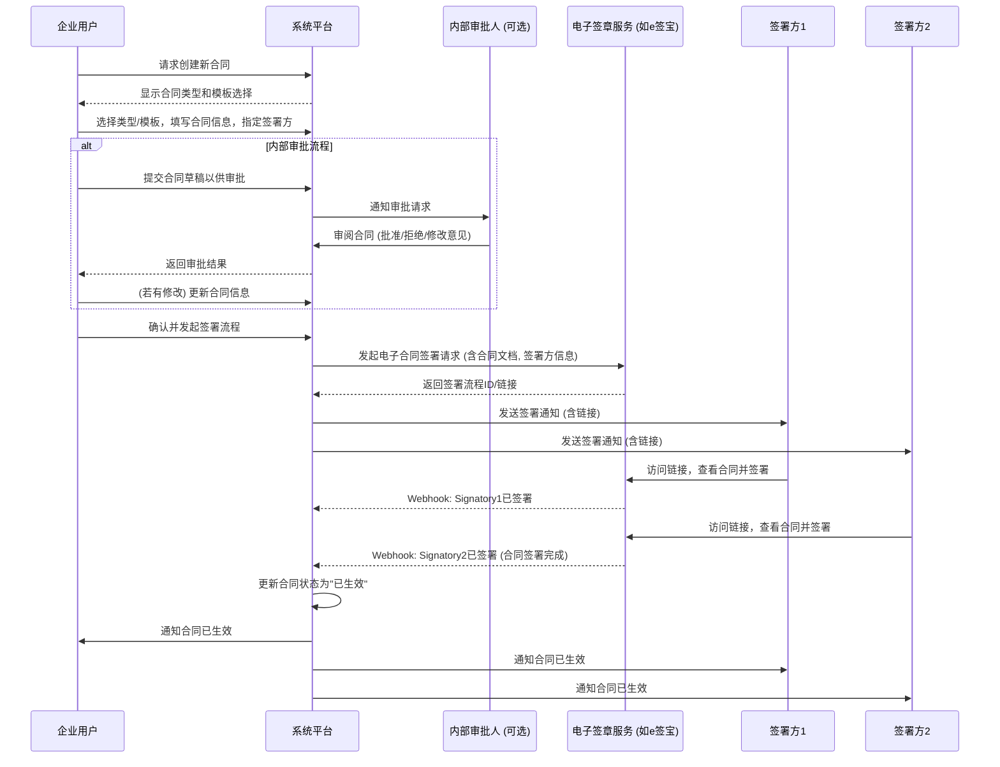
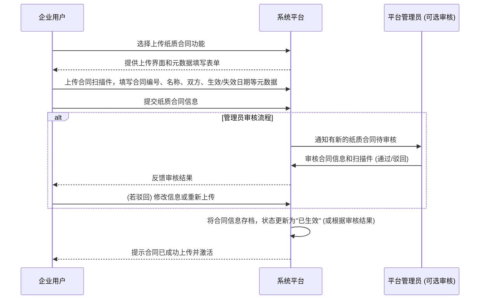
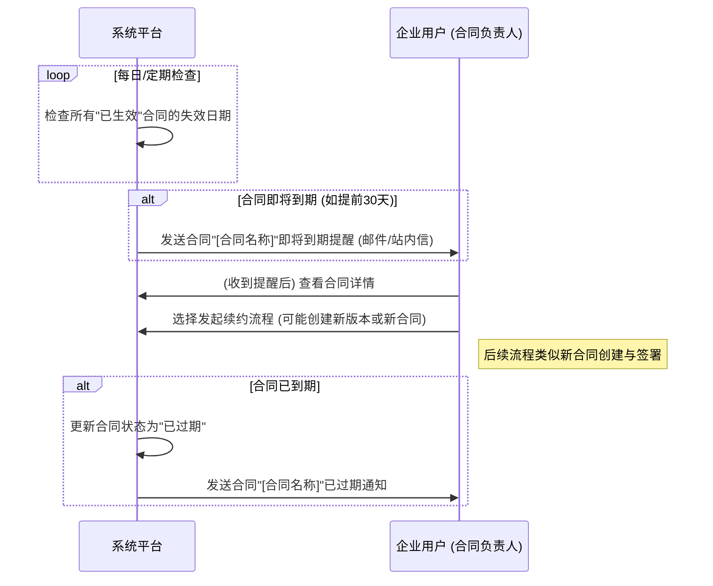
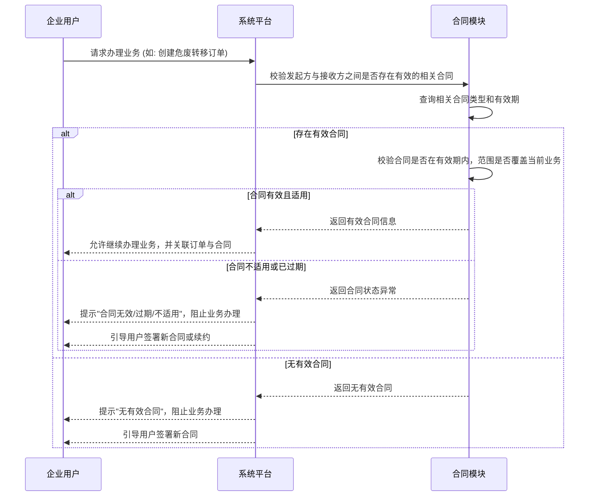
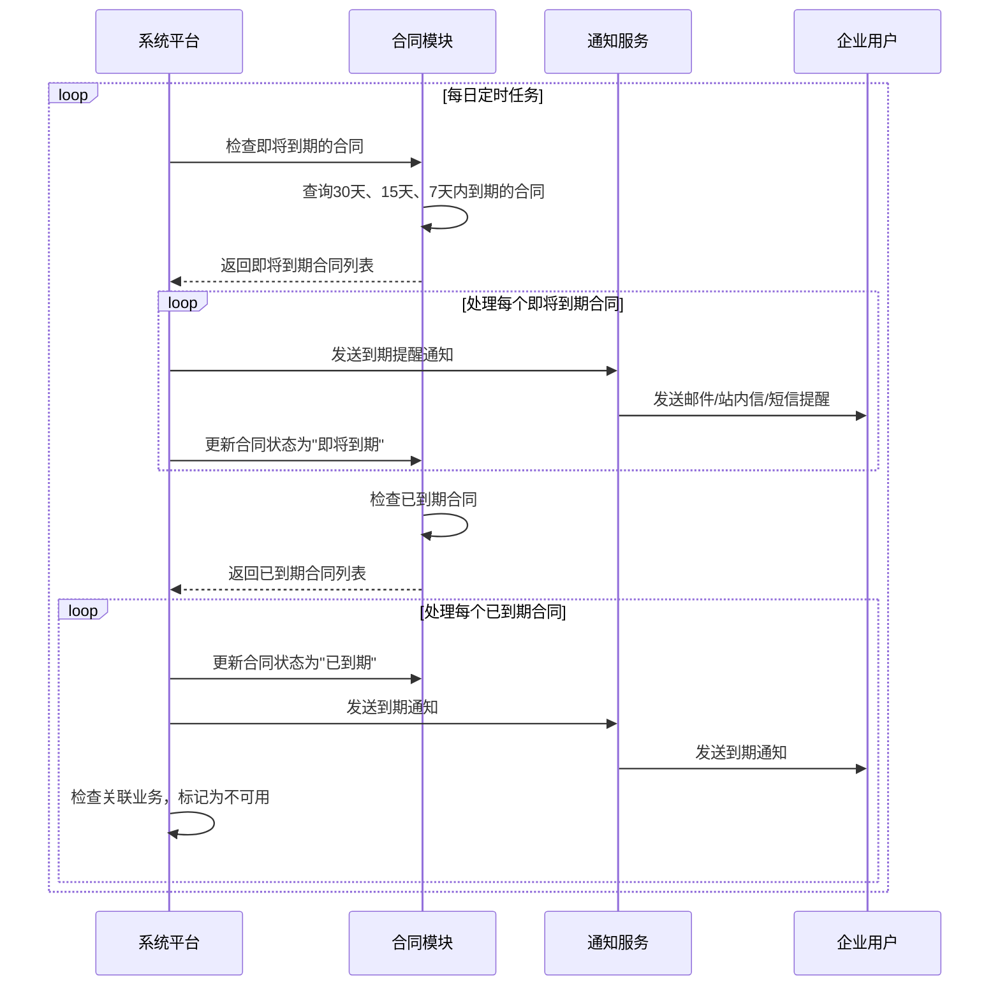
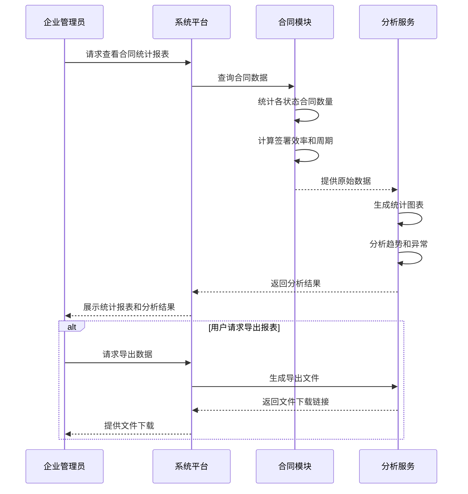

# 合同管理模块 - 业务流程图文档 (Business Process Flow Diagram Document)

以下为合同管理模块的核心业务流程，使用Mermaid语法描述。

### 2.1. 流程1: 新建电子合同并发起签署

### 2.2. 流程2: 上传已签署的纸质合同

### 2.3. 流程3: 合同到期与续约提醒

### 2.4. 流程4: 业务办理时校验关联合同

### 2.5. 流程5: 合同到期自动提醒与处理

### 2.6. 流程6: 合同统计与分析
