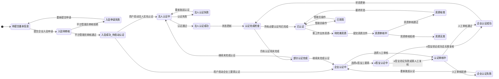
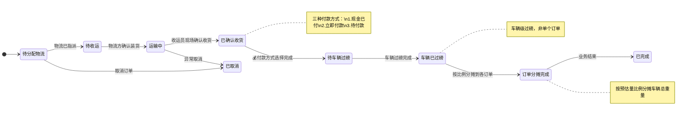
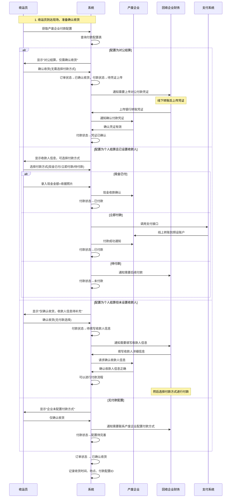
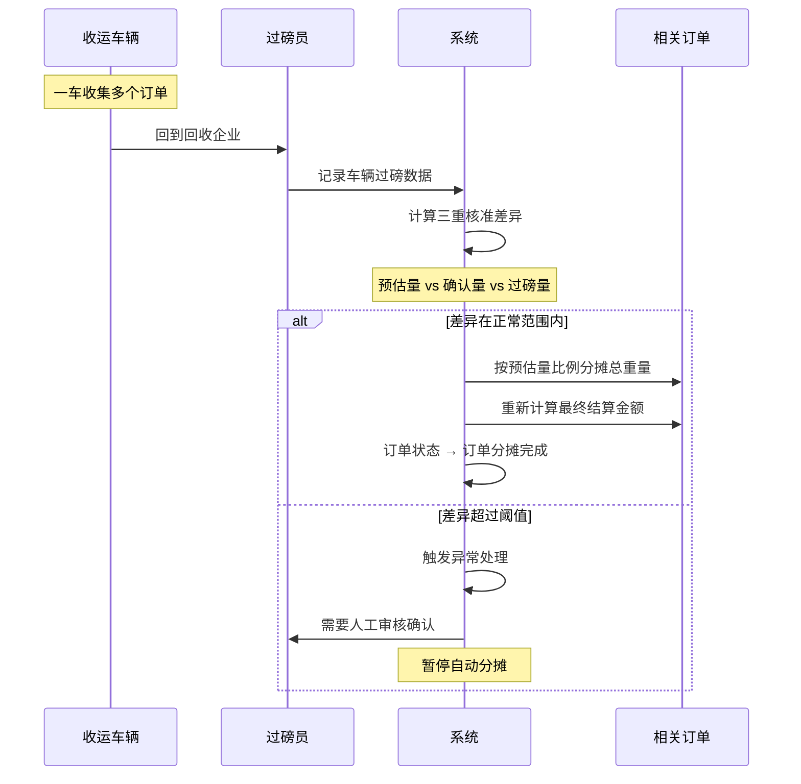
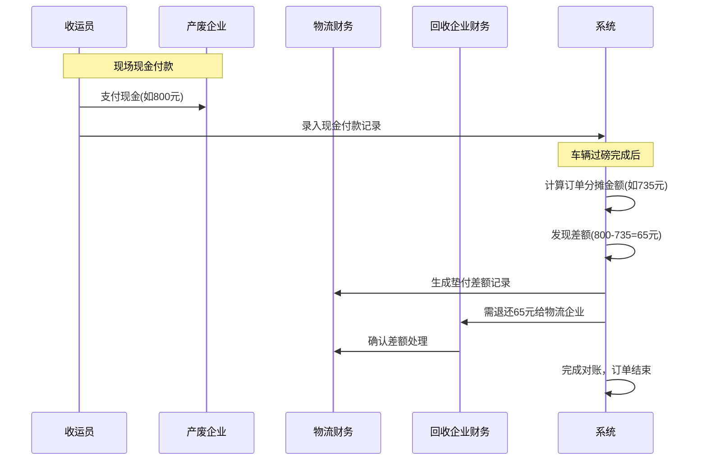
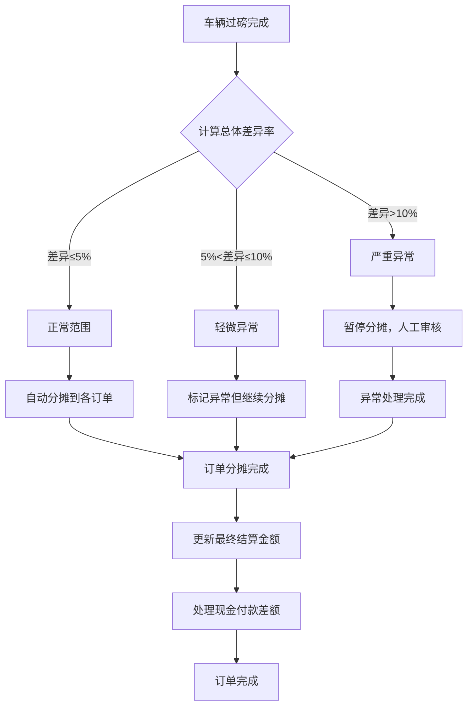
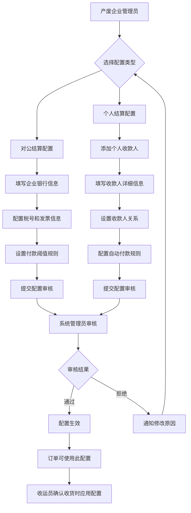
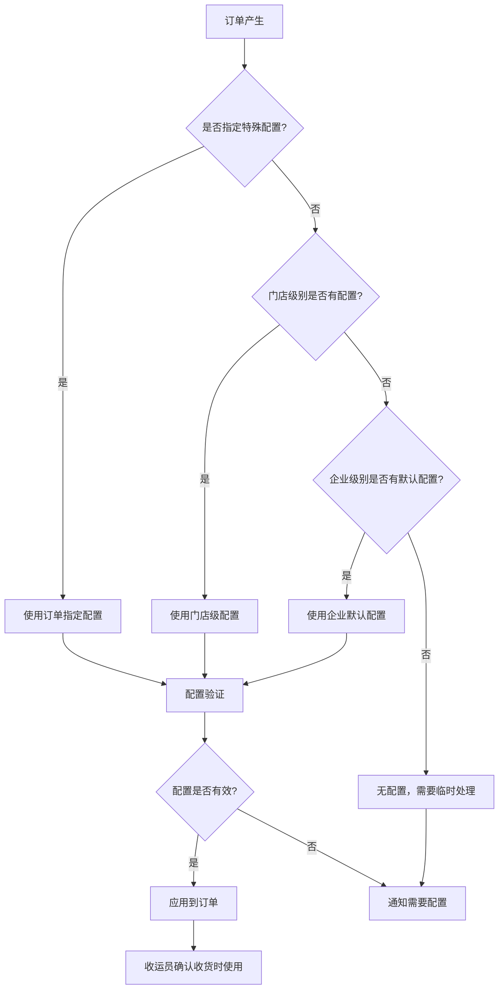
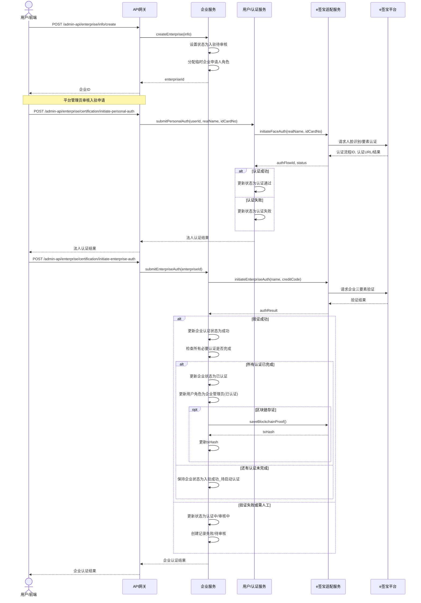

# 企业模块核心业务流程文档

## 1. 概述

本文档描述了企业模块的核心业务流程，旨在阐明用户与系统、以及系统各组件之间的交互。
流程图主要使用 Mermaid 语法绘制。

## 2. 核心业务流程

### 2.1 企业入驻与认证流程

> **重要说明**：根据企业类型，系统采用两种不同的业务流程:
> 1. **企业入驻流程**：适用于回收企业、物流企业和处置企业。这些企业需要通过后台管理系统完成入驻申请、审核和认证流程。入驻企业的用户需要"企业申请人"角色，后续可获得"企业初级管理员"和"企业管理员"等角色。
> 2. **企业绑定流程**：仅适用于产废企业。产废企业的C端用户通过会员中心APP进行企业绑定，无需经过企业入驻审核流程。
>
> 以下描述的主要是企业入驻流程，即回收企业、物流企业和处置企业的流程。产废企业的绑定流程则相对简化。

此流程描述了一个新企业从注册意向到最终认证完成并可以开展业务的全过程。重点区分了"平台入驻审核"和"第三方真实性认证"两个独立阶段。

#### 2.1.1 整体流程概览

```mermaid
flowchart TD
    A[用户访问平台] --> B{已有平台账号?}
    B -- 否 --> C[注册平台账号]
    C --> D[登录平台]
    B -- 是 --> D

    D --> D1{内置租户管理员?}
    D1 -- 是 --> V[直接使用平台功能]

    D1 -- 否 --> D2{用户所属部门(或上级)\n是机构类型且已关联企业?}
    D2 -- 是 --> D3[系统自动创建用户与企业关联]
    D3 --> S[企业关联成功, 用户获得对应角色权限]
    S --> T[根据需要进入认证中心]
    T --> U[完成各项认证]
    U --> V

    D2 -- 否 --> E[进入企业中心/引导企业入驻]
    E --> F{选择操作}
    F -- 创建新企业 --> G[填写企业基本信息]
    G --> G1[选择企业类型]
    G1 --> H[提交企业入驻申请]
    H -- 系统创建企业记录 (状态: 入驻待审核) & 为申请人赋予临时管理权限 --> I[等待平台管理员入驻审核]

    F -- 关联已有企业 --> J[搜索企业]
    J --> J1{企业是否存在?}
    J1 -- 否 --> J2[提示企业不存在,引导创建或重新搜索]
    J2 --> E
    J1 -- 是 --> J3{是否允许直接关联/或需申请?}
    J3 -- 允许直接关联 (如邀请码) --> K[用户与企业关联成功]
    K --> S
    J3 -- 需要申请加入 --> J4[用户提交加入申请]
    J4 --> J5[等待企业管理员审核]
    J5 --> J6{审核通过?}
    J6 -- 是 --> K
    J6 -- 否 --> J7[通知用户申请被拒, 可重新操作]
    J7 --> E

    I --> Q1[管理员审核企业入驻材料]
    Q1 --> Q2{审核通过?}
    Q2 -- 是 --> S1[入驻审核通过, 状态更新为: 待启动认证]
    S1 --> S2[管理员根据企业类型为用户分配正式角色]
    S2 --> S3[引导用户进入认证中心完成实名认证]
    Q2 -- 否 --> Q3[企业状态更新为入驻审核拒绝]
    Q3 --> Q4[通知用户原因, 可重新申请]
    Q4 --> G

    S3 --> NC[用户访问认证中心]
    NC --> NC1{选择认证类型}
    NC1 -- 法人实名认证 --> L[法人代表实名认证]
    NC1 -- 企业实名认证 --> N[企业对公认证/三要素验证]

    L -- 通过e签宝 --> L1[提交法人身份信息]
    L1 --> L2[e签宝人脸/要素校验]
    L2 --> L3{认证成功?}
    L3 -- 是 --> M[法人认证成功记录]
    L3 -- 否 --> L4[提示失败原因, 可重试]
    L4 --> L

    N -- 通过e签宝 --> N1[提交企业名称、信用代码、法人信息]
    N1 --> N2[e签宝验证]
    N2 --> N3{验证成功?}
    N3 -- 是 --> O[企业自动认证成功]
    N3 -- 否 --> P[企业自动认证失败]

    M --> NC2{是否完成所有必要认证?}
    O --> NC2
    NC2 -- 是 --> FC[企业状态更新为已认证, 获得完整业务权限]
    NC2 -- 否 --> NC
    FC --> T

    P --> PR[转人工审核流程]
    PR --> PR1[认证管理员复核]
    PR1 --> PR2{复核通过?}
    PR2 -- 是 --> O
    PR2 -- 否 --> PR3[认证状态更新为失败]
    PR3 --> NC

    subgraph legenda[流程说明]
        direction LR
        manual[人工操作]
        system_auto[系统自动处理]
        esign[e签宝/第三方服务]
    end

    classDef manual fill:#f9f,stroke:#333,stroke-width:2px
    classDef system_auto fill:#ccf,stroke:#333,stroke-width:2px
    classDef esign fill:#cfc,stroke:#333,stroke-width:2px

    class C,D,E,F,G,G1,J,J4,L1,N1,Q1,PR1,T manual
    class H,K,L3,M,N3,O,PR2,S,S1,S2,S3,FC,U,V,D1,D2,D3,J1,J3,J5,J6,NC,NC1,NC2 system_auto
    class L2,N2 esign
```

#### 2.1.2 认证状态流转



**数据表关联:**
*   `enterprise_info`: 记录企业基本信息，`status` 字段反映当前整体状态，包括入驻审核状态和认证状态。
*   `enterprise_type`: 企业类型表，用于分类不同企业并关联不同角色模板。
*   `member_personal_auth`: 记录法人代表的个人实名认证过程和结果。
*   `enterprise_auth_record`: 详细记录每一项认证（如法人认证、企业三要素、人工审核）的步骤、状态、结果、e签宝流水等。
*   `enterprise_audit_log`: 记录管理员的审核操作，包括入驻审核和资质审核。
*   `system_role`: 系统角色表，包含"企业申请人"、"企业初级管理员(待认证)"、"企业管理员(已认证)"等角色。
*   `system_user_role`: 用户与角色关联表。

### 2.2 企业信息管理流程

#### 2.2.1 创建企业与入驻审核 (用户/管理员)
1.  **触发条件:** 用户在平台注册后，希望创建并入驻一个新的企业实体；或管理员代为录入企业。
2.  **流程:**
    *   用户/管理员通过接口 `POST /admin-api/enterprise/info/create` 提交企业核心信息（名称、信用代码、法人姓名等）与企业类型（如适用）。
    *   系统校验信息唯一性（如信用代码）。
    *   在 `enterprise_info` 表创建一条新记录，`status` 初始化为"**入驻待审核**"。
    *   系统为提交申请的用户自动关联一个临时的"**企业申请人**"角色，该角色允许用户在审核前管理其提交的申请资料和查看审核进度。
    *   平台管理员审核企业入驻申请：
        *   审核通过：企业状态更新为"**入驻成功_待启动认证**"，管理员根据企业类型为申请用户分配相应的初始管理员角色（如"企业初级管理员(待认证)"），同时撤销其"企业申请人"角色。用户获得基础操作权限，尤其是访问认证中心的权限。
        *   审核拒绝：企业状态更新为"**入驻申请失败**"，用户收到通知，可重新提交申请。
    *   审核后，如果是通过，系统引导用户进入认证中心完成后续的第三方认证。

#### 2.2.2 认证中心与真实性认证
1.  **触发条件:** 企业入驻申请被平台管理员审核通过后，企业管理员（申请人）需要完成真实性认证。
2.  **流程:**
    *   企业管理员进入"认证中心"，可以看到需要完成的认证项（通常包括法人实名认证和企业对公认证）。
    *   **法人实名认证**:
        *   通过e签宝等第三方服务进行人脸识别和身份要素验证。
        *   认证结果记录到 `member_personal_auth` 表。
    *   **企业对公认证**:
        *   通过e签宝等第三方服务进行企业三要素（企业名称、统一社会信用代码、法定代表人）验证。
        *   认证结果记录到 `enterprise_auth_record` 表。
    *   当所有必要的认证项都完成并通过后，企业状态自动更新为"**已认证**"，企业获得平台完整的业务功能权限。

#### 2.2.3 更新企业信息 (用户/管理员)
1.  **触发条件:** 企业信息发生变更，需要更新。
2.  **流程:**
    *   用户/管理员通过接口 `PUT /admin-api/enterprise/info/update` 提交要更新的企业信息。
    *   系统根据更新的字段判断是否涉及核心信息（如企业名称、法人、信用代码）。
    *   **核心信息变更:** 可能需要将企业状态置为"待重新认证"或触发特定的审核流程，并记录变更到 `enterprise_audit_log`。
    *   **非核心信息变更:** 直接更新 `enterprise_info` 表对应字段。
    *   所有变更操作记录到 `enterprise_audit_log` (如果配置了详细审计)。

#### 2.2.4 查询企业信息
*   **获取企业详情 (`GET /admin-api/enterprise/info/get`):**
    *   根据企业ID查询 `enterprise_info` 表获取基本信息。
    *   关联查询 `enterprise_auth_record` 获取最新认证状态和历史。
    *   关联查询 `enterprise_qualification` 获取已上传的资质列表。
    *   关联查询 `enterprise_store` 获取门店列表。
    *   关联查询 `enterprise_user_relation` 获取关联用户。
*   **分页查询企业列表 (`GET /admin-api/enterprise/info/page`):**
    *   管理员根据条件（名称、类型、状态等）从 `enterprise_info` 表分页查询。

### 2.3 企业资质管理流程

#### 2.3.1 添加企业资质
1.  **触发条件:** 企业完成核心认证后，需要上传和管理其经营所需的各类资质证书。
2.  **流程:**
    *   企业用户通过接口 `POST /admin-api/enterprise/qualification/create` 提交资质信息（资质类型、名称、编号、有效期、发证机关、资质文件附件ID）。
    *   系统在 `enterprise_qualification` 表创建一条新记录，`status` 初始化为"待审核"或根据配置直接为"有效"（如果无需审核）。
    *   如果需要审核，则进入资质审核子流程。

#### 2.3.2 资质审核 (如果启用)
1.  **触发条件:** 新资质提交且系统配置需要审核，或资质信息更新触发重新审核。
2.  **流程:**
    *   管理员在后台查看待审核资质列表。
    *   管理员审核资质文件和信息的真实性、有效性。
    *   通过接口 `PUT /admin-api/enterprise/qualification/audit` (假设) 更新资质记录的 `status`（有效/审核拒绝）和 `audit_remarks`。
    *   操作记录到 `enterprise_audit_log`。

#### 2.3.3 资质到期提醒 (系统功能)
1.  **触发条件:** 定时任务扫描 `enterprise_qualification` 表。
2.  **流程:**
    *   系统检查 `expiry_date` 字段，对于即将到期（如提前30天、15天、7天）的资质，生成提醒通知。
    *   通过站内信、邮件、短信等方式通知企业管理员。

### 2.4 多门店管理流程 (US-015 相关)

#### 2.4.1 创建门店
1.  **触发条件:** 已认证的企业希望添加下属门店。
2.  **流程:**
    *   企业管理员通过接口 `POST /admin-api/enterprise/store/create` 提交门店信息（名称、地址、联系方式等，可关联 `parent_id` 形成层级）。
    *   系统在 `enterprise_store` 表创建记录。

#### 2.4.2 门店数据隔离与汇总
*   **数据隔离:** 门店用户登录后，其查询和操作的数据范围（如订单、客户）应基于其所属的 `store_id` 进行过滤。
*   **数据汇总:** 总部用户（企业管理员）在查看报表或数据时，系统能汇总其下所有门店的数据；同时提供按门店筛选查看的能力。

### 2.5 用户与企业/门店关系管理流程

#### 2.5.1 关联用户到企业/门店
1.  **触发条件:** 企业管理员添加员工，或用户接受企业邀请。
2.  **流程:**
    *   通过接口 `POST /admin-api/enterprise/user-relation/add`。
    *   在 `enterprise_user_relation` 表创建记录，指定 `user_id`, `enterprise_id`, `store_id` (可选), `relation_type`。
    *   同时可能需要为用户分配相应的系统角色（关联 `system_role` 和 `system_user_role`）。

#### 2.5.2 角色与权限管理
1.  **企业申请人角色**：提交企业入驻申请的用户获得此临时角色，具有查看和管理自己申请的权限。
2.  **企业初级管理员(待认证)角色**：入驻审核通过后，申请人被授予此角色，拥有基础企业信息管理权限和访问认证中心的权限。
3.  **企业管理员(已认证)角色**：企业完成所有必要第三方认证后，管理员角色获得完整业务功能权限。
4.  **权限动态校验**：系统可能会针对某些敏感操作，额外检查关联企业的认证状态（如只有"已认证"状态的企业才能发起某些业务交易）。

### 2.6 危废转移订单流程 (收货确认与付款触发)

#### 2.6.1 订单状态流转优化

危废转移订单的状态流转已针对您的业务需求进行了优化，明确了收货确认与付款触发的关系：



#### 2.6.2 核心业务原则

**重要变更**：
1. **收货确认 = 付款触发**：收运员确认收货时选择付款方式，立即或后续触发付款
2. **车辆级过磅**：针对整车进行过磅，而非单个订单
3. **订单分摊机制**：车辆总过磅量按预估量比例分摊到各个订单
4. **三重核准**：出车预估量 vs 收运员确认量 vs 实际过磅量的相互核准

#### 2.6.3 收货确认与付款配置流程 (重新设计)



#### 2.6.4 车辆过磅与订单分摊流程



#### 2.6.5 现金付款对账流程



### 2.7 三重核准业务逻辑

#### 2.7.1 核准环节说明

1. **出车预估量**：收运车辆出发前，系统汇总该车计划收集的所有订单预估量
2. **收运员确认量**：收运员在各个产废企业现场确认实际收集的数量
3. **实际过磅量**：车辆回到回收企业后，整车过磅获得的净重量

#### 2.7.2 差异分析与责任判定



#### 2.7.3 典型业务场景

**场景示例：一车收集3个订单**

| 环节 | 订单A | 订单B | 订单C | 总计 |
|------|-------|-------|-------|------|
| **出车预估量** | 2.0吨 | 1.5吨 | 1.5吨 | 5.0吨 |
| **收运员确认量** | 2.1吨 | 1.4吨 | 1.6吨 | 5.1吨 |
| **车辆过磅量** | - | - | - | 4.9吨 |
| **分摊后数量** | 1.96吨 | 1.47吨 | 1.47吨 | 4.9吨 |
| **分摊比例** | 40% | 30% | 30% | 100% |

**付款方式与最终结算：**
- 订单A：立即付款 → 已收1000元 → 分摊后应收980元 → 多收20元
- 订单B：现金已付800元 → 分摊后应收735元 → 多收65元，需退还物流企业
- 订单C：待付款 → 分摊后应付735元 → 管理员确认付款

### 2.8 系统集成接口要求

#### 2.8.1 地磅设备集成

1. **接口类型**：支持串口(RS232/RS485)、网络接口(TCP/IP)
2. **数据格式**：重量数据实时推送，JSON格式
3. **异常处理**：设备离线自动切换手动录入
4. **数据校验**：皮重、毛重、净重的逻辑校验

#### 2.8.2 支付接口集成

1. **工行反向开票接口**：企业对个人付款+自动开票
2. **第三方支付接口**：微信企业付款、支付宝等
3. **银行接口**：对公转账接口
4. **支付状态同步**：实时回调确认支付结果

#### 2.8.3 国家固废系统对接

1. **联单数据同步**：订单完成后自动推送
2. **运输轨迹上报**：GPS定位数据定时上传
3. **异常情况报告**：超时、路线偏离等异常自动上报

### 2.9 业务规则配置

#### 2.9.1 过磅差异阈值配置

- **正常范围**：±5% (系统自动处理)
- **异常预警**：±5%~±10% (记录异常但继续处理)  
- **严重异常**：>±10% (暂停处理，人工介入)

#### 2.9.2 现金付款管理

- **差额阈值**：差额≤10元自动处理，>10元需确认
- **对账周期**：按月批量对账
- **退款处理**：支持现金退款和下次订单抵扣

#### 2.9.3 订单分摊规则

- **默认方式**：按预估量比例分摊
- **备选方式**：按确认量比例、平均分摊、人工指定
- **调整权限**：财务主管以上权限可人工调整分摊结果

### 2.10 产废企业付款配置管理流程

#### 2.10.1 付款方式配置流程



#### 2.10.2 付款配置优先级规则



## 3. 关键接口交互说明 (时序图示例)

### 3.1 企业通过e签宝认证时序图 (简化)

