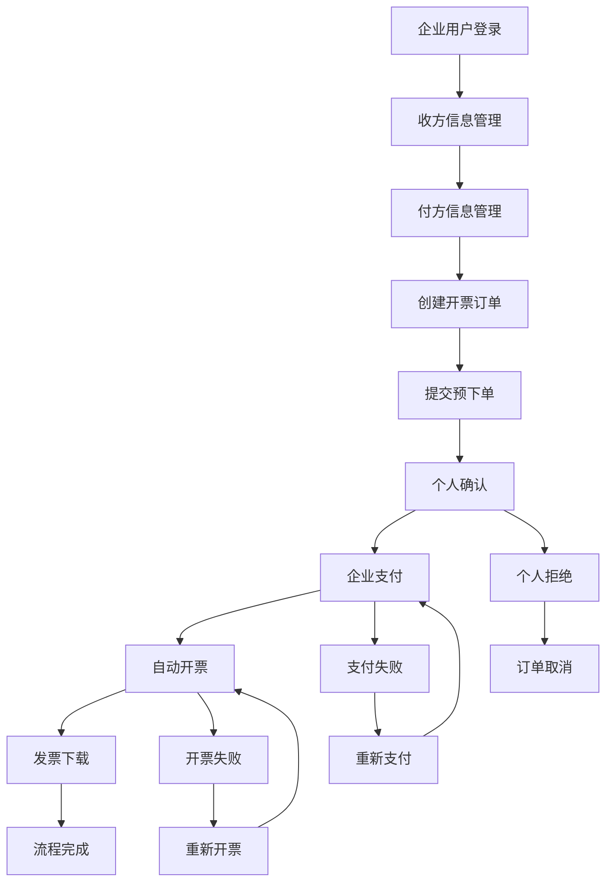
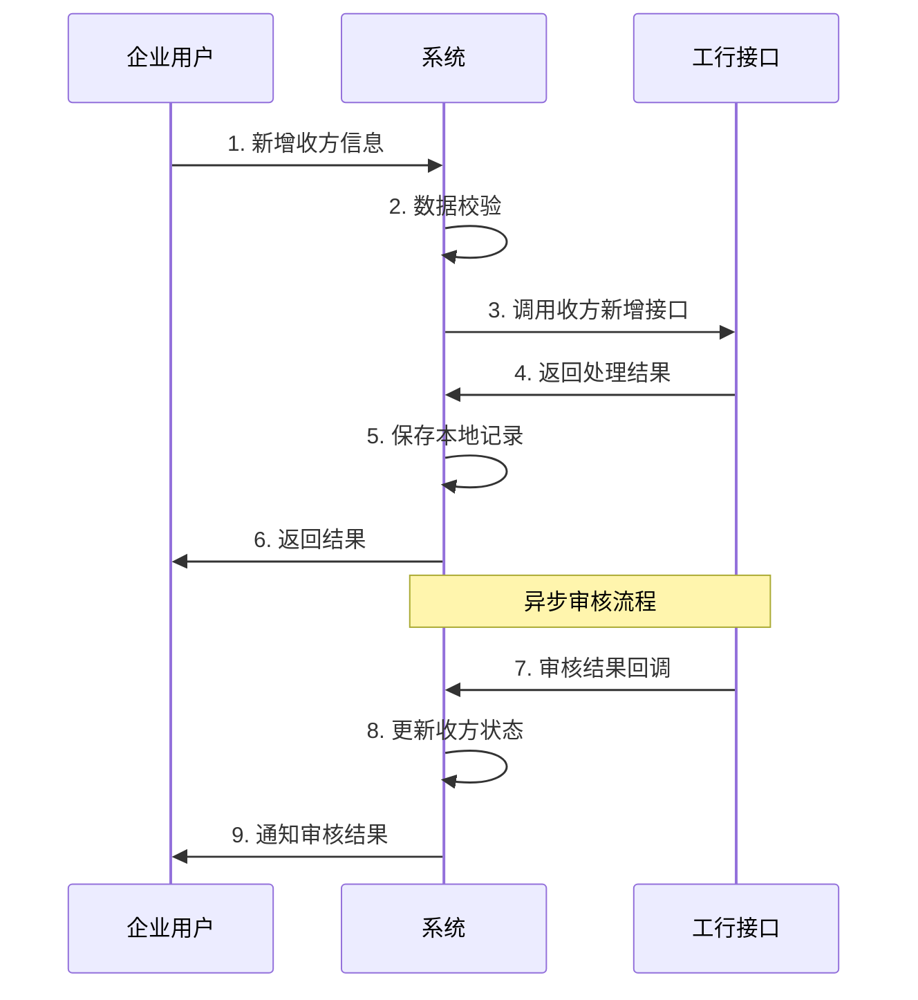
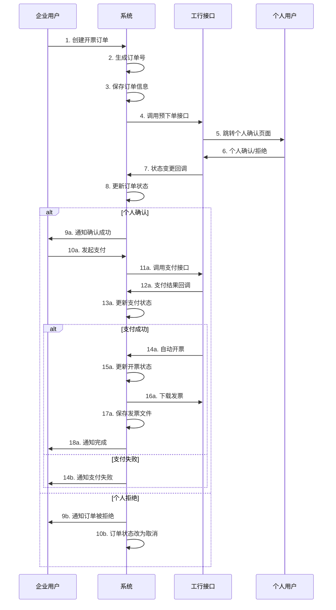
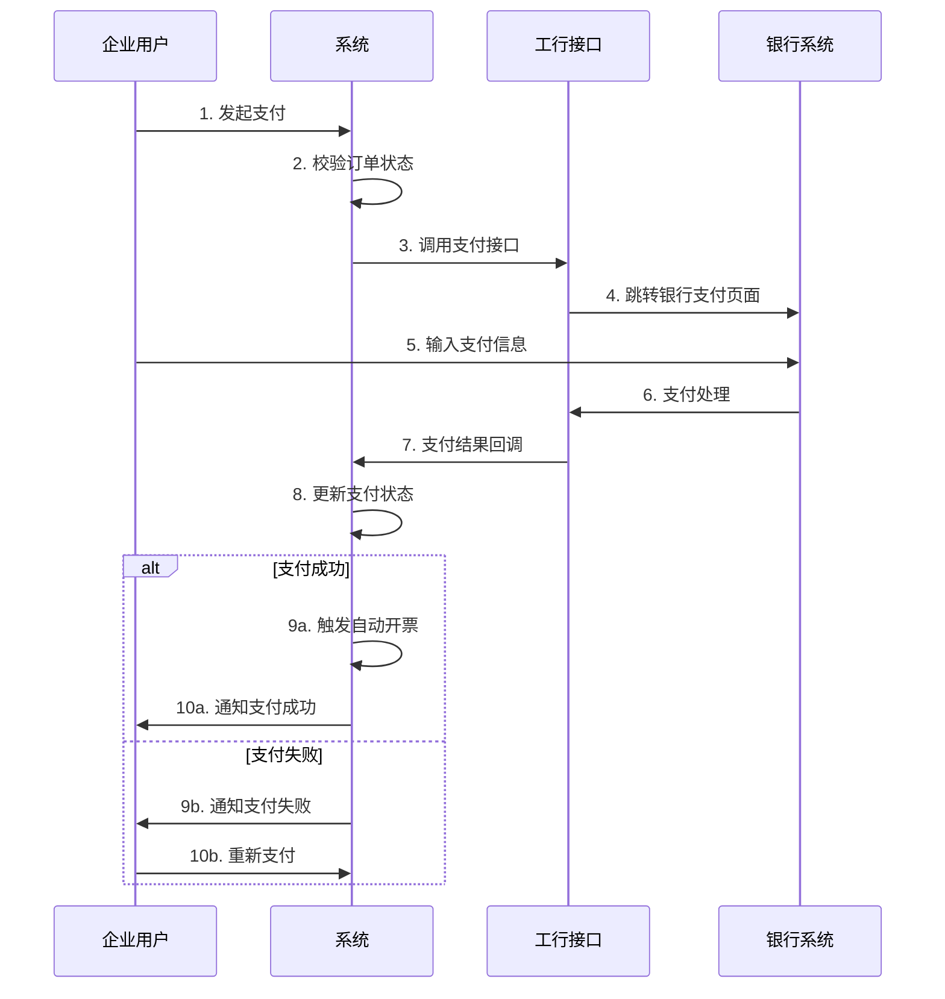
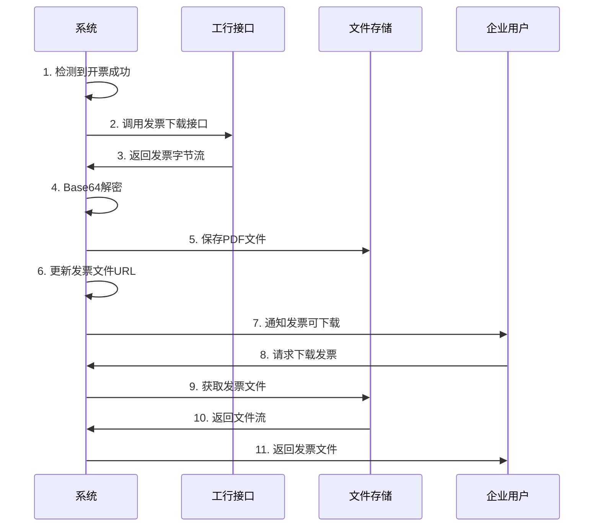
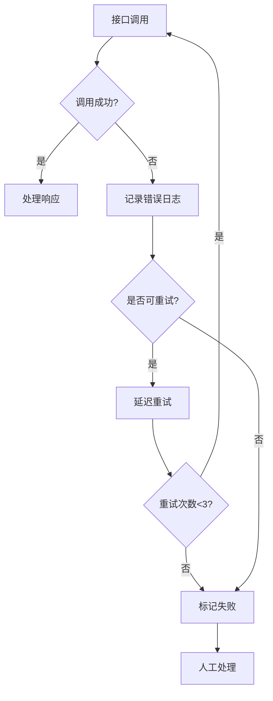
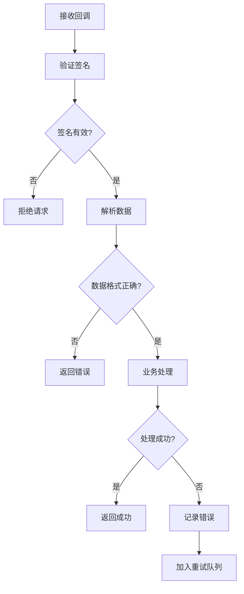

# 工商银行反向开票业务流程设计文档

## 1. 概述

本文档详细描述了工商银行反向开票业务的完整流程设计，包括业务流程、技术架构、接口设计和异常处理等内容。

## 2. 业务流程设计

### 2.1 整体业务流程图



### 2.2 详细业务流程

#### 2.2.1 收方信息管理流程



**流程说明：**
1. 企业用户提交个人销售方信息
2. 系统进行数据格式校验和业务规则校验
3. 调用工行收方新增接口提交信息
4. 工行返回提交结果（成功/失败）
5. 系统保存本地记录，状态为"待审核"
6. 向用户返回提交结果
7. 工行异步审核完成后，通过回调接口通知结果
8. 系统更新收方状态（审核通过/拒绝）
9. 通知用户审核结果

#### 2.2.2 开票订单流程



**流程说明：**
1. 企业用户创建开票订单，填写商品信息、金额等
2. 系统生成唯一订单号
3. 保存订单信息到数据库，状态为"待确认"
4. 调用工行预下单接口，传递订单信息
5. 工行跳转到个人确认页面
6. 个人用户确认或拒绝订单
7. 工行通过回调接口通知状态变更
8. 系统更新订单状态
9. 根据个人确认结果进行后续处理

#### 2.2.3 支付流程



#### 2.2.4 发票下载流程



### 2.3 异常处理流程

#### 2.3.1 接口调用失败处理



#### 2.3.2 回调处理异常



## 3. 技术架构设计

### 3.1 系统架构图

```
┌─────────────────┐    ┌─────────────────┐    ┌─────────────────┐
│   前端界面      │    │   管理后台      │    │   移动端        │
└─────────────────┘    └─────────────────┘    └─────────────────┘
         │                       │                       │
         └───────────────────────┼───────────────────────┘
                                 │
┌─────────────────────────────────┼─────────────────────────────────┐
│                    API网关层     │                                 │
└─────────────────────────────────┼─────────────────────────────────┘
                                 │
┌─────────────────────────────────┼─────────────────────────────────┐
│                   业务服务层     │                                 │
│  ┌─────────────┐ ┌─────────────┐ ┌─────────────┐ ┌─────────────┐  │
│  │ 收方管理    │ │ 付方管理    │ │ 订单管理    │ │ 发票管理    │  │
│  └─────────────┘ └─────────────┘ └─────────────┘ └─────────────┘  │
│  ┌─────────────┐ ┌─────────────┐ ┌─────────────┐ ┌─────────────┐  │
│  │ 支付管理    │ │ 回调处理    │ │ 文件管理    │ │ 配置管理    │  │
│  └─────────────┘ └─────────────┘ └─────────────┘ └─────────────┘  │
└─────────────────────────────────┼─────────────────────────────────┘
                                 │
┌─────────────────────────────────┼─────────────────────────────────┐
│                   数据访问层     │                                 │
│  ┌─────────────┐ ┌─────────────┐ ┌─────────────┐ ┌─────────────┐  │
│  │ MySQL数据库 │ │ Redis缓存   │ │ 文件存储    │ │ 消息队列    │  │
│  └─────────────┘ └─────────────┘ └─────────────┘ └─────────────┘  │
└─────────────────────────────────┼─────────────────────────────────┘
                                 │
┌─────────────────────────────────┼─────────────────────────────────┐
│                   外部接口层     │                                 │
│                    ┌─────────────┐                                │
│                    │ 工行API接口 │                                │
│                    └─────────────┘                                │
└─────────────────────────────────────────────────────────────────┘
```

### 3.2 模块设计

#### 3.2.1 工行SDK模块

```java
// 工行API客户端
public class IcbcApiClient {
    // 收方管理
    public PayeeAddResponse addPayee(PayeeAddRequest request);
    public PayeeQueryResponse queryPayee(PayeeQueryRequest request);
    
    // 开票管理
    public InvoicePreOrderResponse preOrder(InvoicePreOrderRequest request);
    public InvoiceQueryResponse queryInvoice(InvoiceQueryRequest request);
    public InvoiceDownloadResponse downloadInvoice(InvoiceDownloadRequest request);
    
    // 支付管理
    public PaymentResponse payment(PaymentRequest request);
}

// 签名工具类
public class IcbcSignUtils {
    public static String sign(String data, String privateKey);
    public static boolean verify(String data, String sign, String publicKey);
}

// 加密工具类
public class IcbcEncryptUtils {
    public static String aesEncrypt(String data, String key);
    public static String aesDecrypt(String data, String key);
}
```

#### 3.2.2 业务服务模块

```java
// 收方管理服务
@Service
public class PayeeService {
    Long createPayee(PayeeCreateReqVO reqVO);
    void updatePayee(PayeeUpdateReqVO reqVO);
    PayeeRespVO getPayee(Long id);
    PageResult<PayeeRespVO> pagePayee(PayeePageReqVO reqVO);
    void processAuditCallback(PayeeAuditCallbackDTO callback);
}

// 订单管理服务
@Service
public class InvoiceOrderService {
    Long createOrder(InvoiceOrderCreateReqVO reqVO);
    void updateOrder(InvoiceOrderUpdateReqVO reqVO);
    InvoiceOrderRespVO getOrder(Long id);
    PageResult<InvoiceOrderRespVO> pageOrder(InvoiceOrderPageReqVO reqVO);
    String preOrder(Long orderId);
    void processStatusCallback(InvoiceStatusCallbackDTO callback);
}

// 支付管理服务
@Service
public class PaymentService {
    String createPayment(Long orderId);
    void processPaymentCallback(PaymentCallbackDTO callback);
}

// 发票管理服务
@Service
public class InvoiceService {
    void downloadInvoice(Long orderId);
    byte[] getInvoiceFile(Long orderId);
    void processRedInvoice(RedInvoiceCreateReqVO reqVO);
}
```

### 3.3 数据库设计要点

#### 3.3.1 核心表关系

```
icbc_payee_info (收方信息)
    ↓ (1:N)
icbc_invoice_order (开票订单)
    ↓ (1:N)
icbc_order_item (订单明细)

icbc_payer_info (付方信息)
    ↓ (1:N)
icbc_invoice_order (开票订单)

icbc_invoice_order (开票订单)
    ↓ (1:1)
icbc_red_invoice (红冲发票)
```

#### 3.3.2 状态字段设计

**订单状态 (order_status):**
- 0: 待确认
- 1: 已确认
- 2: 已支付
- 3: 已开票
- 4: 已完成
- 9: 已取消

**开票状态 (invoice_status):**
- 0: 未开票
- 1: 开票中
- 2: 开票成功
- 3: 开票失败

**支付状态 (payment_status):**
- 0: 未支付
- 1: 支付中
- 2: 支付成功
- 3: 支付失败

## 4. 接口设计

### 4.1 RESTful API设计

#### 4.1.1 收方管理接口

```java
@RestController
@RequestMapping("/icbc/payee")
public class PayeeController {
    
    @PostMapping("/create")
    @Operation(summary = "创建收方信息")
    public CommonResult<Long> createPayee(@Valid @RequestBody PayeeCreateReqVO reqVO);
    
    @GetMapping("/page")
    @Operation(summary = "收方信息分页")
    public CommonResult<PageResult<PayeeRespVO>> pagePayee(@Valid PayeePageReqVO reqVO);
    
    @PostMapping("/audit-callback")
    @Operation(summary = "收方审核回调")
    public CommonResult<Boolean> auditCallback(@RequestBody PayeeAuditCallbackDTO callback);
}
```

#### 4.1.2 订单管理接口

```java
@RestController
@RequestMapping("/icbc/order")
public class InvoiceOrderController {
    
    @PostMapping("/create")
    @Operation(summary = "创建开票订单")
    public CommonResult<Long> createOrder(@Valid @RequestBody InvoiceOrderCreateReqVO reqVO);
    
    @PostMapping("/pre-order/{id}")
    @Operation(summary = "提交预下单")
    public CommonResult<String> preOrder(@PathVariable Long id);
    
    @PostMapping("/payment/{id}")
    @Operation(summary = "发起支付")
    public CommonResult<String> payment(@PathVariable Long id);
    
    @GetMapping("/download-invoice/{id}")
    @Operation(summary = "下载发票")
    public void downloadInvoice(@PathVariable Long id, HttpServletResponse response);
}
```

### 4.2 回调接口设计

```java
@RestController
@RequestMapping("/icbc/callback")
public class IcbcCallbackController {
    
    @PostMapping("/payee-audit")
    public String payeeAuditCallback(@RequestBody String callbackData);
    
    @PostMapping("/invoice-status")
    public String invoiceStatusCallback(@RequestBody String callbackData);
    
    @PostMapping("/payment-result")
    public String paymentResultCallback(@RequestBody String callbackData);
}
```

## 5. 安全设计

### 5.1 数据安全

1. **敏感数据加密存储**
   - 身份证号码：AES加密
   - 银行卡号：AES加密
   - 手机号码：部分掩码显示

2. **接口签名验证**
   - 所有工行接口调用使用RSA签名
   - 回调接口验证工行签名

3. **HTTPS传输**
   - 所有外部接口调用使用HTTPS
   - 回调接口强制HTTPS

### 5.2 访问控制

1. **权限控制**
   - 基于角色的访问控制(RBAC)
   - 接口级权限验证

2. **数据隔离**
   - 多租户数据隔离
   - 企业间数据隔离

## 6. 监控与运维

### 6.1 日志设计

1. **业务日志**
   - 订单状态变更日志
   - 支付流程日志
   - 开票流程日志

2. **接口调用日志**
   - 请求参数（脱敏）
   - 响应结果
   - 调用耗时
   - 错误信息

3. **系统日志**
   - 应用启动日志
   - 异常错误日志
   - 性能监控日志

### 6.2 监控指标

1. **业务指标**
   - 订单成功率
   - 支付成功率
   - 开票成功率
   - 平均处理时间

2. **技术指标**
   - 接口响应时间
   - 接口成功率
   - 系统资源使用率
   - 数据库连接池状态

### 6.3 告警机制

1. **业务告警**
   - 订单失败率超阈值
   - 支付失败率超阈值
   - 开票失败率超阈值

2. **技术告警**
   - 接口响应时间超时
   - 系统异常错误
   - 数据库连接异常

## 7. 部署方案

### 7.1 环境规划

1. **开发环境**
   - 本地开发环境
   - 联调测试环境

2. **测试环境**
   - 功能测试环境
   - 性能测试环境

3. **生产环境**
   - 生产环境
   - 灾备环境

### 7.2 配置管理

1. **环境配置**
   - 数据库连接配置
   - Redis连接配置
   - 工行接口配置

2. **安全配置**
   - 密钥配置
   - 证书配置
   - 加密配置

## 8. 风险控制

### 8.1 技术风险

1. **接口依赖风险**
   - 工行接口不可用
   - 接口响应超时
   - 接口返回异常

2. **数据一致性风险**
   - 分布式事务一致性
   - 回调处理失败
   - 状态同步异常

### 8.2 业务风险

1. **资金安全风险**
   - 重复支付
   - 支付金额错误
   - 退款处理

2. **发票合规风险**
   - 发票信息错误
   - 重复开票
   - 红冲处理

### 8.3 风险应对措施

1. **技术措施**
   - 接口重试机制
   - 熔断降级
   - 数据校验
   - 事务补偿

2. **业务措施**
   - 人工审核
   - 异常处理流程
   - 应急预案

## 9. 总结

本流程设计文档详细描述了工行反向开票业务的完整实现方案，涵盖了从业务流程到技术实现的各个方面。在实际开发过程中，需要根据具体的业务需求和技术环境进行适当调整和优化。

关键成功因素：
1. 严格按照工行接口规范进行开发
2. 完善的异常处理和重试机制
3. 全面的日志记录和监控
4. 严格的安全控制措施
5. 完整的测试验证流程 