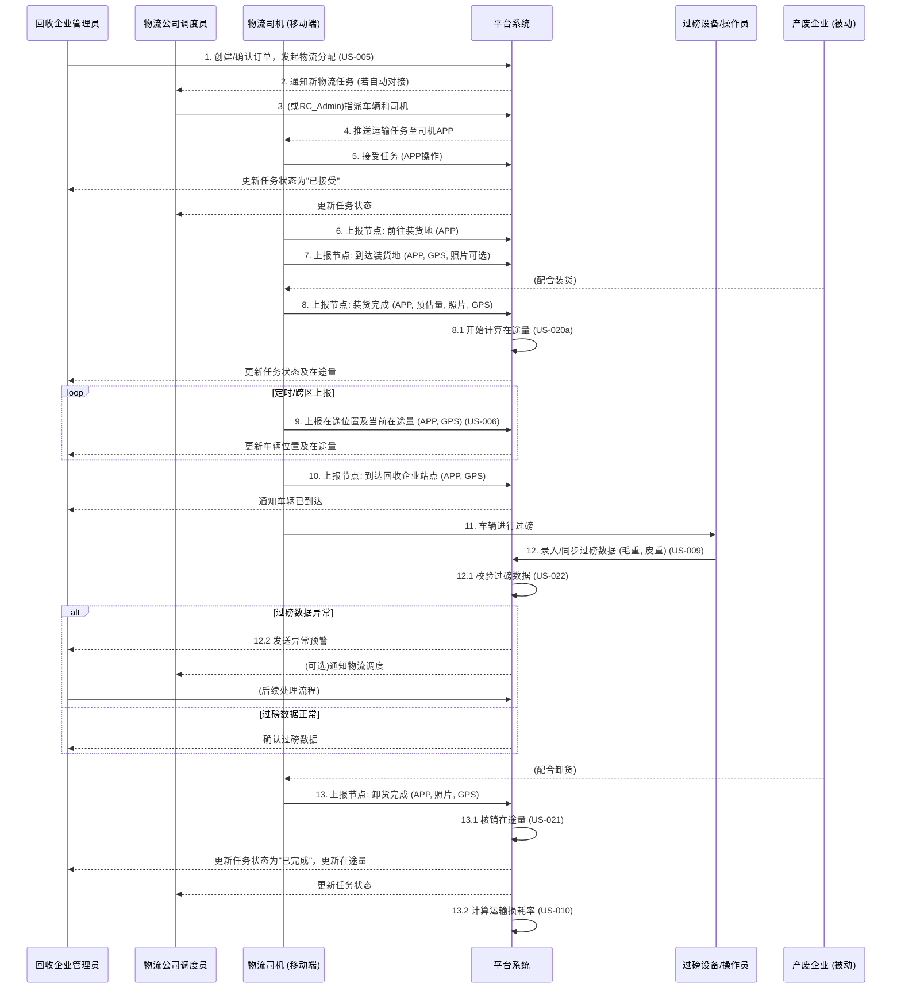
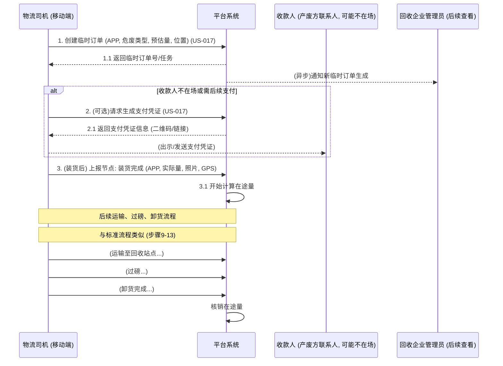
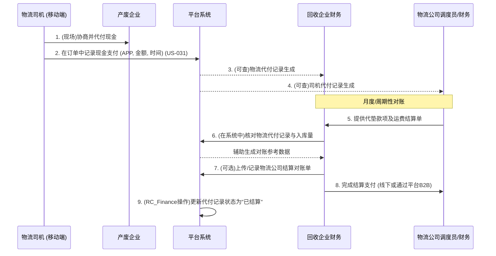

# 物流运输核心业务流程文档

## 1. 引言

本文档描述了"危废再生资源全流程追溯SaaS平台"中物流运输模块的核心业务流程。旨在清晰地展现物流从任务分配到最终完成的各个环节和关键活动。

## 2. 核心流程图示

### 2.1 标准预约订单物流流程

### 2.2 "扫街回收"临时订单物流流程 (简化)

### 2.3 物流代付现金与对账流程 (US-031)

## 3. 关键业务活动描述

### 3.1 物流任务分配
-   **触发场景：** 回收企业订单确认后，需要安排运输。
-   **执行者：** 回收企业调度员或系统（基于规则自动分配）。
-   **流程：**
    1.  选择或系统推荐合适的物流公司（自有团队或第三方）。
    2.  (若物流公司内部也使用本系统)物流公司调度员进一步指派具体车辆和司机。
    3.  系统记录分配信息，任务状态变为"待接受"或"已指派"。
    4.  通知司机有新的运输任务。

### 3.2 运输节点上报
-   **触发场景：** 司机在运输过程中的各个关键阶段。
-   **执行者：** 物流司机。
-   **流程：**
    1.  **接受任务：** 司机在移动端确认接受任务。
    2.  **出发前往装货地：** 司机点击出发。
    3.  **到达装货地：** 司机确认到达，系统可记录GPS和时间，司机可上传照片。
    4.  **装货完成：** 司机确认装货完毕，填写实际装载/预估危废信息，上传照片（如磅单、货物状态）。系统开始计算此订单的在途量。
    5.  **在途：** 司机正常行驶，系统可定时（如30分钟）或司机手动上报GPS位置，或跨越行政区域时自动/手动上报。在途量随车移动。
    6.  **到达回收企业站点：** 司机确认到达目的地（回收企业指定的堆场或过磅点）。
    7.  **卸货完成：** 司机在完成卸货后确认。系统根据过磅的实际回收量核销此订单的在途量。 （US-021）
-   **数据：** 节点类型、时间戳、GPS坐标、现场照片、备注等。

### 3.3 在途量管理
-   **计算：** 从"装货完成"节点开始，到"卸货完成"节点（在途量被核销）结束。
-   **监控：** 回收企业管理者可在平台查看车辆的实时位置和在途危废量 (US-020)。
-   **预警：** 在途量超过安全阈值或长时间未移动等异常情况触发预警。
-   **技术支持：** 需要CEP引擎支持实时计算和高并发处理 (US-020a)。

### 3.4 过磅与异常处理
-   **触发场景：** 货物运抵回收企业后，卸货前或卸货中。
-   **执行者：** 回收企业过磅员/司机配合。
-   **流程：**
    1.  车辆驶上地磅，记录毛重。
    2.  卸货完成后，车辆再次过磅，记录皮重。
    3.  系统计算净重，并与订单预估量或产废方发货量进行比对。
    4.  **异常检测 (US-022)：** 若差异超过预设阈值（如±5%），系统冻结订单，生成异常工单，并通知相关人员（回收企业管理员、调度员）。
    5.  **数据记录：** 过磅时间、重量数据、过磅单照片、操作员等。
    6.  支持"补单标记"以区分原始和修正数据 (US-009)。

### 3.5 临时订单（扫街回收）处理
-   **触发场景：** 司机在非预约情况下，现场发现并回收危废。
-   **执行者：** 物流司机。
-   **流程：**
    1.  司机通过移动端快速创建临时订单，记录危废类型、预估量、产废方信息（若有）、地理位置 (US-017)。
    2.  系统为此临时订单生成唯一的标识，并纳入物流任务管理。
    3.  若收款人不在场，可生成临时支付凭证 (US-017)。
    4.  后续的装货、运输、过磅、卸货流程与标准订单类似，但订单来源被标记为"扫街回收" (US-006)。

### 3.6 物流代付现金与对账 (US-031)
-   **触发场景:** 司机在回收现场，根据约定需要向产废方垫付现金。
-   **执行者:** 物流司机记录，回收企业财务与物流公司财务对账。
-   **流程:**
    1.  司机付款后，在移动端APP的对应订单中记录代付金额和时间。
    2.  回收企业财务可查阅这些代付记录。
    3.  周期性（如月度），回收企业财务与物流公司就这些代垫款项以及运费，结合实际入库量（过磅数据）进行对账。
    4.  系统辅助生成对账数据，支持上传和记录双方确认的结算单。
    5.  完成对账和结算支付后，更新平台内代付记录的状态。 

## 4. 异常处理流程概要

-   **运输延误：** 司机上报延误原因，系统通知调度员，调度员协调或通知客户。
-   **货物损坏/泄漏风险：** 司机立即上报，启动应急预案，通知相关方。
-   **过磅差异大：** 系统预警，冻结流程，人工介入核实，可能需要补单或调整。
-   **GPS信号丢失：** 系统记录最后位置，并尝试恢复，若长时间丢失则预警。
-   **司机无法联系：** 调度员尝试多种方式联系，必要时启动应急方案。 