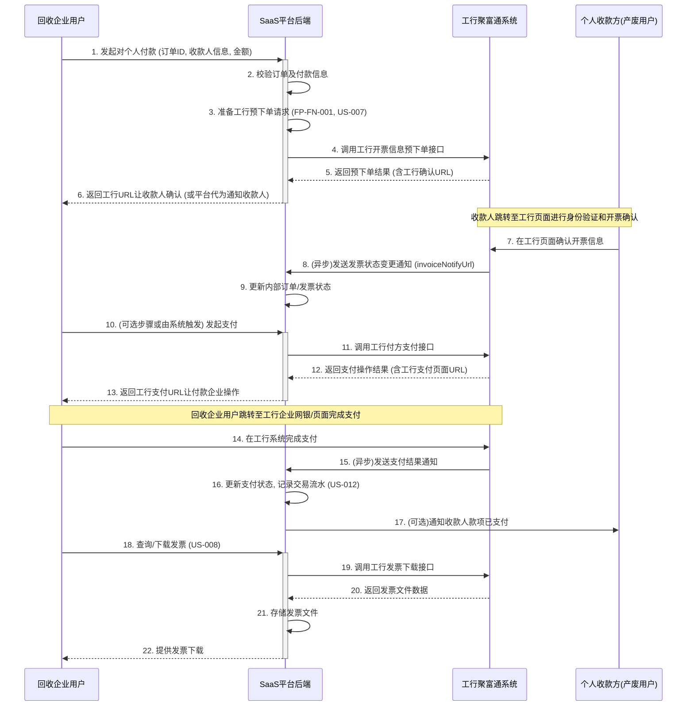
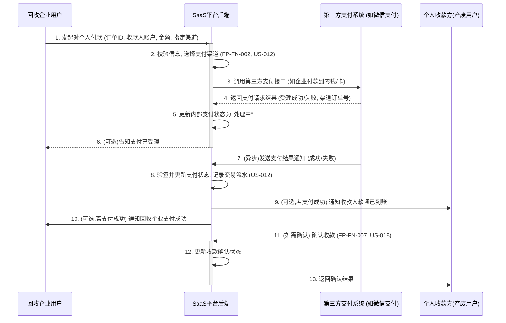
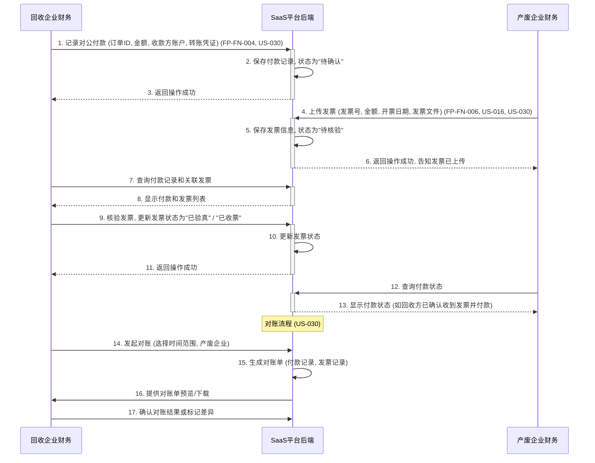
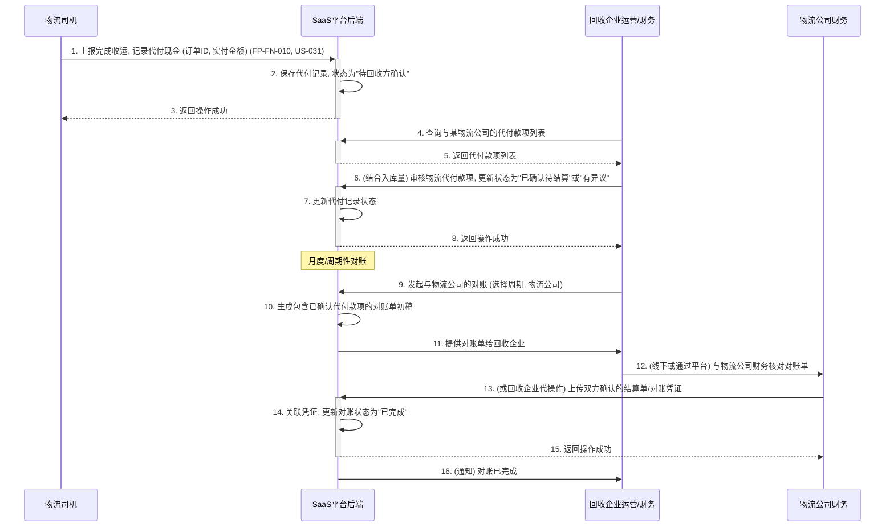

# 企业付款模块业务流程图

## 1. 引言
本文档使用 Mermaid 流程图描述企业付款模块中的核心业务流程，旨在清晰地展示不同角色和系统间的交互。

## 2. 核心业务流程

### 2.1 B2C支付流程 (以工行反向开票为例)

### 2.2 B2C支付流程 (其他第三方支付渠道)

### 2.3 B2B对公转账与发票协同流程

### 2.4 物流代垫款项对账流程

