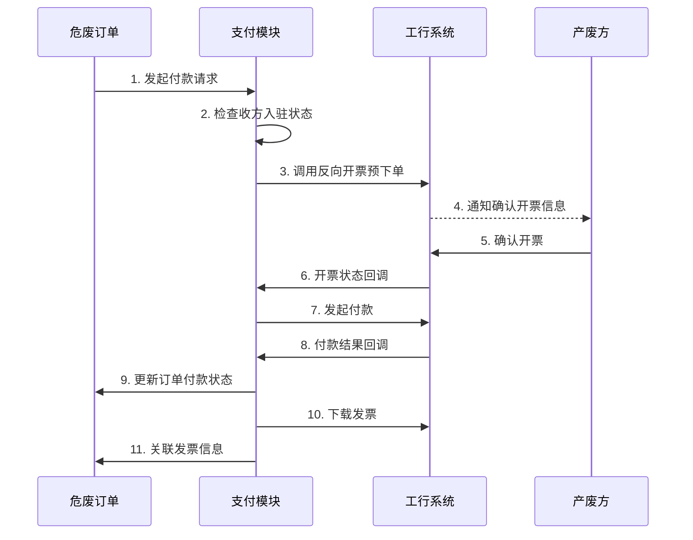

# 危废转移与支付模块集成方案

## 1. 概述

本文档定义了危废转移模块与企业付款模块的集成方案，重点关注工行反向发票的核心功能实现。通过清晰的模块职责划分和接口设计，确保支付流程与业务流程的无缝对接。

## 2. 模块职责划分

### 2.1 危废转移模块职责
- **订单管理**：创建、维护危废转移订单的完整生命周期
- **金额计算**：根据过磅分摊计算最终结算金额
- **付款触发**：在适当的业务节点触发付款流程
- **状态同步**：接收支付状态更新，同步订单付款状态

### 2.2 支付模块职责
- **支付执行**：对接工行等支付渠道，执行实际支付操作
- **发票管理**：通过工行反向开票生成和管理电子发票
- **收方管理**：管理个人收款方在工行的入驻和审核
- **对账管理**：提供支付对账和发票对账功能

### 2.3 接口协作方式



## 3. 工行反向发票集成设计

### 3.1 核心业务流程

#### 3.1.1 收方入驻流程
1. **首次付款前检查**：检查产废方（个人）是否已在工行入驻
2. **自动入驻**：未入驻则自动调用工行收方新增接口
3. **审核等待**：等待工行审核通过后才能进行支付
4. **状态同步**：通过回调接口接收审核结果

#### 3.1.2 反向开票支付流程
1. **预下单**：提交订单信息到工行，生成预开票单
2. **用户确认**：产废方通过短信链接确认开票信息
3. **开票成功**：工行生成电子发票
4. **发起支付**：回收企业通过工行完成支付
5. **发票下载**：支付成功后下载并存储发票

### 3.2 数据映射关系

| 危废订单字段 | 工行接口字段 | 说明 |
|------------|------------|------|
| order_no | outOrderId | 订单号映射 |
| producing_enterprise_id | outVendorId | 产废方编号 |
| recycling_enterprise_id | outUserId/appId | 付方编号 |
| final_amount | orderAmount | 结算金额 |
| waste_name | projectName | 商品名称 |
| allocated_quantity | goodsNum | 实际数量 |

## 4. 数据库设计

### 4.1 支付订单扩展表 (`pay_waste_order_ext`)

```sql
CREATE TABLE `pay_waste_order_ext` (
  `id` bigint(20) NOT NULL COMMENT '主键ID',
  `waste_order_id` bigint(20) NOT NULL COMMENT '危废订单ID',
  `payment_order_id` bigint(20) NOT NULL COMMENT '支付订单ID',
  
  -- 工行收方信息
  `icbc_receiver_status` tinyint(4) DEFAULT '0' COMMENT '工行收方状态(0:未入驻,1:审核中,2:已入驻,3:审核拒绝)',
  `icbc_receiver_account` varchar(50) DEFAULT '' COMMENT '工行收方账号',
  `icbc_receiver_audit_time` datetime DEFAULT NULL COMMENT '工行审核时间',
  
  -- 工行开票信息
  `icbc_pre_order_status` tinyint(4) DEFAULT '0' COMMENT '预下单状态(0:未创建,1:待确认,2:已确认,3:已取消)',
  `icbc_invoice_code` varchar(20) DEFAULT '' COMMENT '发票代码',
  `icbc_invoice_number` varchar(20) DEFAULT '' COMMENT '发票号码',
  `icbc_invoice_date` date DEFAULT NULL COMMENT '开票日期',
  `icbc_invoice_url` varchar(500) DEFAULT '' COMMENT '发票下载地址',
  
  -- 支付信息
  `payment_trigger_time` datetime DEFAULT NULL COMMENT '支付触发时间',
  `payment_complete_time` datetime DEFAULT NULL COMMENT '支付完成时间',
  `payment_channel_txn_id` varchar(128) DEFAULT '' COMMENT '工行交易流水号',
  
  -- 业务关联
  `waste_code` varchar(50) NOT NULL COMMENT '危废代码',
  `waste_category` varchar(100) NOT NULL COMMENT '危废类别',
  `is_agricultural_purchase` bit(1) DEFAULT b'0' COMMENT '是否农产品收购',
  `is_scrap_purchase` bit(1) DEFAULT b'0' COMMENT '是否报废产品收购',
  
  `remark` varchar(500) DEFAULT '' COMMENT '备注',
  `tenant_id` bigint(20) NOT NULL DEFAULT '0' COMMENT '租户ID',
  `creator` varchar(64) DEFAULT '' COMMENT '创建者',
  `create_time` datetime NOT NULL DEFAULT CURRENT_TIMESTAMP COMMENT '创建时间',
  `updater` varchar(64) DEFAULT '' COMMENT '更新者',
  `update_time` datetime NOT NULL DEFAULT CURRENT_TIMESTAMP ON UPDATE CURRENT_TIMESTAMP COMMENT '更新时间',
  `deleted` bit(1) NOT NULL DEFAULT b'0' COMMENT '是否删除',
  PRIMARY KEY (`id`),
  UNIQUE KEY `uk_waste_order_id` (`waste_order_id`, `deleted`),
  KEY `idx_payment_order_id` (`payment_order_id`),
  KEY `idx_icbc_receiver_status` (`icbc_receiver_status`),
  KEY `idx_tenant_id_deleted` (`tenant_id`, `deleted`)
) ENGINE=InnoDB DEFAULT CHARSET=utf8mb4 COMMENT='危废订单支付扩展表';
```

### 4.2 工行收方信息表 (`pay_icbc_receiver`)

```sql
CREATE TABLE `pay_icbc_receiver` (
  `id` bigint(20) NOT NULL COMMENT '主键ID',
  `out_user_id` varchar(20) NOT NULL COMMENT '外部用户编号',
  `receiver_type` tinyint(4) NOT NULL COMMENT '收方类型(1:企业,3:自然人)',
  `receiver_name` varchar(60) NOT NULL COMMENT '收方户名',
  `receiver_account` varchar(50) NOT NULL COMMENT '收方账号',
  `id_type` varchar(3) NOT NULL COMMENT '证件类型(0:身份证)',
  `id_no` varchar(18) NOT NULL COMMENT '证件号码',
  `mobile` varchar(20) NOT NULL COMMENT '手机号',
  
  -- 审核信息
  `audit_status` tinyint(4) NOT NULL DEFAULT '0' COMMENT '审核状态(0:待提交,1:审核中,2:审核通过,3:审核拒绝)',
  `submit_time` datetime DEFAULT NULL COMMENT '提交时间',
  `audit_time` datetime DEFAULT NULL COMMENT '审核时间',
  `audit_remark` varchar(255) DEFAULT '' COMMENT '审核备注',
  
  -- 工行返回信息
  `icbc_receiver_status` varchar(1) DEFAULT '' COMMENT '工行收方状态(0:不可用,1:可用)',
  `icbc_medium_id` varchar(50) DEFAULT '' COMMENT '工行电子账户账号',
  `icbc_openacct_status` varchar(2) DEFAULT '' COMMENT '开户状态(00:初始,01:开户中,02:开户成功,03:开户失败)',
  
  -- 扩展信息
  `occupation` varchar(3) DEFAULT '' COMMENT '职业',
  `address` varchar(120) DEFAULT '' COMMENT '常用住址',
  `company_name` varchar(60) DEFAULT '' COMMENT '关联企业名称',
  
  `tenant_id` bigint(20) NOT NULL DEFAULT '0' COMMENT '租户ID',
  `creator` varchar(64) DEFAULT '' COMMENT '创建者',
  `create_time` datetime NOT NULL DEFAULT CURRENT_TIMESTAMP COMMENT '创建时间',
  `updater` varchar(64) DEFAULT '' COMMENT '更新者',
  `update_time` datetime NOT NULL DEFAULT CURRENT_TIMESTAMP ON UPDATE CURRENT_TIMESTAMP COMMENT '更新时间',
  `deleted` bit(1) NOT NULL DEFAULT b'0' COMMENT '是否删除',
  PRIMARY KEY (`id`),
  UNIQUE KEY `uk_out_user_id` (`out_user_id`, `deleted`),
  UNIQUE KEY `uk_receiver_account` (`receiver_account`, `deleted`),
  KEY `idx_audit_status` (`audit_status`),
  KEY `idx_id_no` (`id_no`),
  KEY `idx_tenant_id_deleted` (`tenant_id`, `deleted`)
) ENGINE=InnoDB DEFAULT CHARSET=utf8mb4 COMMENT='工行收方信息表';
```

## 5. 接口设计

### 5.1 危废模块调用支付模块接口

#### 5.1.1 发起危废订单支付
```java
POST /payment/waste/initiate-payment

请求参数：
{
  "wasteOrderId": 123456,                    // 危废订单ID
  "orderNo": "WO202401010001",               // 订单号
  "payerId": 789,                            // 付款方ID（回收企业）
  "payeeId": 456,                            // 收款方ID（产废方）
  "amount": 1580.50,                         // 支付金额
  "wasteInfo": {
    "wasteCode": "900-041-49",              // 危废代码
    "wasteName": "废矿物油",                 // 危废名称
    "quantity": 2.5,                        // 数量
    "unit": "吨"                            // 单位
  },
  "specificElements": "24",                  // 特定要素(24:报废产品收购)
  "remark": "危废转移订单付款"
}

响应：
{
  "code": 0,
  "data": {
    "paymentId": "PAY202401010001",
    "status": "PROCESSING",
    "icbcUrl": "https://xxx",              // 需要跳转的工行页面
    "needReceiverAudit": true              // 是否需要等待收方审核
  }
}
```

#### 5.1.2 查询支付状态
```java
GET /payment/waste/status/{wasteOrderId}

响应：
{
  "code": 0,
  "data": {
    "paymentStatus": "SUCCESS",
    "paidTime": "2024-01-01 10:30:00",
    "invoiceStatus": "ISSUED",
    "invoiceNumber": "12345678",
    "invoiceUrl": "/payment/invoice/download/xxx"
  }
}
```

### 5.2 支付模块回调危废模块接口

#### 5.2.1 支付状态变更通知
```java
POST /waste/payment/notify

请求参数：
{
  "wasteOrderId": 123456,
  "paymentId": "PAY202401010001",
  "status": "SUCCESS",
  "paidTime": "2024-01-01 10:30:00",
  "channelTxnId": "ICBC202401010001",
  "invoiceInfo": {
    "invoiceCode": "1234",
    "invoiceNumber": "12345678",
    "invoiceDate": "2024-01-01",
    "invoiceAmount": 1580.50
  }
}
```

## 6. 核心功能实现

### 6.1 收方自动入驻

```java
@Service
public class IcbcReceiverService {
    
    @Autowired
    private IcbcApiClient icbcApiClient;
    
    /**
     * 检查并自动入驻收方
     */
    public IcbcReceiverStatus checkAndRegisterReceiver(ProducerInfo producer) {
        // 1. 查询本地是否已有记录
        PayIcbcReceiver receiver = receiverMapper.selectByIdNo(producer.getIdNo());
        
        if (receiver == null) {
            // 2. 查询工行是否已入驻
            IcbcReceiverQueryResp queryResp = icbcApiClient.queryReceiver(
                producer.getAccount(), producer.getIdNo()
            );
            
            if (queryResp.getReceiverStatus() == null) {
                // 3. 未入驻，自动提交入驻申请
                IcbcReceiverAddReq addReq = buildReceiverAddReq(producer);
                IcbcReceiverAddResp addResp = icbcApiClient.addReceiver(addReq);
                
                // 4. 保存入驻记录
                receiver = saveReceiverRecord(producer, addResp);
                
                // 5. 等待审核回调
                return IcbcReceiverStatus.AUDITING;
            }
        }
        
        return receiver.getAuditStatus() == 2 ? 
            IcbcReceiverStatus.ACTIVE : IcbcReceiverStatus.AUDITING;
    }
}
```

### 6.2 反向开票支付流程

```java
@Service
public class WastePaymentService {
    
    /**
     * 发起危废订单支付
     */
    @Transactional
    public PaymentInitiateResp initiatePayment(WastePaymentReq req) {
        // 1. 创建支付订单
        PayPaymentOrder paymentOrder = createPaymentOrder(req);
        
        // 2. 创建危废支付扩展记录
        PayWasteOrderExt orderExt = createWasteOrderExt(req, paymentOrder);
        
        // 3. 检查收方入驻状态
        IcbcReceiverStatus receiverStatus = checkReceiverStatus(req.getPayeeId());
        if (receiverStatus != IcbcReceiverStatus.ACTIVE) {
            return PaymentInitiateResp.needWaitAudit();
        }
        
        // 4. 构建工行预下单请求
        IcbcInvoicePreOrderReq preOrderReq = buildPreOrderRequest(req, paymentOrder);
        
        // 5. 调用工行预下单接口
        IcbcInvoicePreOrderResp preOrderResp = icbcApiClient.invoicePreOrder(preOrderReq);
        
        // 6. 更新支付订单状态
        updatePaymentOrderStatus(paymentOrder.getId(), PaymentStatus.PENDING_CONFIRMATION);
        
        // 7. 返回结果
        return PaymentInitiateResp.success(paymentOrder.getPaymentNo(), preOrderResp.getIcbcUrl());
    }
    
    /**
     * 处理工行开票回调
     */
    public void handleInvoiceCallback(IcbcInvoiceCallback callback) {
        // 1. 验证签名
        verifyIcbcSign(callback);
        
        // 2. 更新预下单状态
        updatePreOrderStatus(callback.getOutOrderId(), callback.getResult());
        
        // 3. 如果开票成功，自动发起支付
        if ("pass".equals(callback.getResult())) {
            autoInitiatePayment(callback.getOutOrderId());
        }
    }
}
```

## 7. 开发计划

### 7.1 第一阶段：基础集成（2周）

#### Week 1
- [ ] 支付模块基础框架搭建
- [ ] 工行API SDK开发
  - [ ] 通用请求/响应处理
  - [ ] 签名验签实现
  - [ ] AES加密解密
- [ ] 数据库表创建
  - [ ] 支付订单扩展表
  - [ ] 工行收方信息表

#### Week 2
- [ ] 收方管理功能
  - [ ] 收方入驻接口对接
  - [ ] 收方查询接口对接
  - [ ] 审核回调处理
- [ ] 单元测试编写

### 7.2 第二阶段：核心支付（2周）

#### Week 3
- [ ] 反向开票功能
  - [ ] 预下单接口对接
  - [ ] 预查询接口对接
  - [ ] 开票回调处理
- [ ] 支付功能
  - [ ] 付方支付接口对接
  - [ ] 支付状态查询

#### Week 4
- [ ] 发票管理
  - [ ] 发票下载接口对接
  - [ ] 发票存储管理
  - [ ] 发票查询功能
- [ ] 集成测试

### 7.3 第三阶段：业务集成（1周）

#### Week 5
- [ ] 危废模块集成
  - [ ] 支付发起接口
  - [ ] 状态查询接口
  - [ ] 回调通知处理
- [ ] 端到端测试
- [ ] 性能优化

### 7.4 第四阶段：完善优化（1周）

#### Week 6
- [ ] 异常处理完善
  - [ ] 超时重试机制
  - [ ] 异常状态恢复
- [ ] 监控告警
  - [ ] 支付成功率监控
  - [ ] 接口调用监控
- [ ] 文档完善

## 8. 技术要点

### 8.1 安全性
- 工行API密钥使用配置中心管理，避免硬编码
- 敏感信息（身份证、银行账号）加密存储
- 所有回调接口进行签名验证
- 支付操作增加二次确认机制

### 8.2 可靠性
- 实现幂等性设计，防止重复支付
- 关键操作记录详细日志
- 异步任务使用消息队列保证可靠性
- 定时任务补偿机制

### 8.3 性能优化
- 收方信息本地缓存，减少查询
- 批量订单支付优化
- 发票文件使用OSS存储
- 接口调用使用连接池

### 8.4 监控指标
- 支付成功率
- 平均支付耗时
- 工行接口调用成功率
- 发票生成成功率

## 9. 风险控制

### 9.1 技术风险
- **工行接口不稳定**：实现降级方案，支持手动处理
- **网络超时**：合理设置超时时间，实现重试机制
- **数据不一致**：使用分布式事务或最终一致性方案

### 9.2 业务风险
- **收方审核失败**：提供人工介入处理流程
- **支付金额错误**：增加金额校验和人工审核
- **发票信息错误**：支持发票作废和重开

### 9.3 合规风险
- **个人信息保护**：严格遵守个人信息保护法
- **支付合规**：确保支付流程符合监管要求
- **发票合规**：确保发票信息真实准确

## 10. 总结

通过清晰的模块职责划分和完善的接口设计，危废转移模块与支付模块可以实现良好的集成。工行反向发票作为核心功能，通过自动化的收方入驻、智能的支付流程和完善的发票管理，大大提升了危废转移业务的效率和合规性。

整个开发周期预计6周，通过分阶段实施，可以确保每个环节的质量和稳定性。 