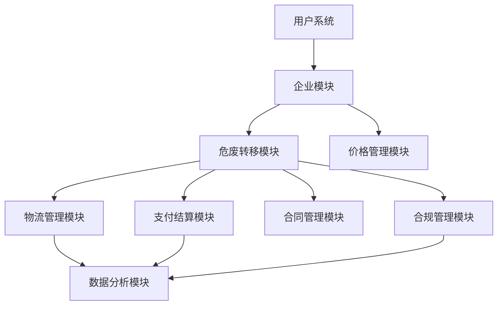

# 危废再生资源全流程追溯SaaS平台 - 详细实施计划

**版本：** 2.0  
**制定日期：** 2024年1月  
**项目周期：** 16-20周（4-5个月）  

## 1. 项目概览

### 1.1 项目愿景
构建一个符合国家《固废法》要求的危废（废矿物油）全流程数字化追溯平台，实现从产废企业到回收企业的完整业务闭环，确保危废转移合法合规、全程可追溯，优化企业资金结算与对账效率，提升运营管理智能化水平。

### 1.2 核心价值主张
- **合规保障**：确保危废转移全程合法合规，满足监管要求
- **效率提升**：优化企业间交易和结算流程，减少人工操作
- **透明追溯**：实现危废转移全过程数字化追溯
- **智能决策**：通过数据分析支持业务决策优化

### 1.3 技术栈选型
```yaml
后端技术:
  - 框架: Spring Boot 2.7.18 (Java 8)
  - 数据库: MySQL 8.0
  - ORM: MyBatis Plus 3.5.3.1
  - 缓存: Redis 6.x
  - 消息队列: RocketMQ 4.9
  - 任务调度: XXL-Job
  - API文档: Swagger/OpenAPI 3
  - 认证授权: Spring Security + JWT

前端技术:
  - 管理后台: Vue 3 + Element Plus
  - 移动端: UniApp (支持H5/小程序/APP)
  
第三方服务:
  - 电子签名: e签宝
  - 支付服务: 工行反向开票、微信企业支付
  - 地图服务: 高德地图API
  - 短信服务: 阿里云短信
```

### 1.4 系统架构设计

```
┌─────────────────────────────────────────────────────────────┐
│                        前端应用层                             │
├─────────────┬─────────────┬─────────────┬─────────────────┤
│  管理后台    │  产废企业端  │  回收企业端  │   物流端APP     │
│  (Vue3)     │  (UniApp)   │  (UniApp)   │   (UniApp)      │
└─────────────┴─────────────┴─────────────┴─────────────────┘
                              │
┌─────────────────────────────────────────────────────────────┐
│                        网关层                                │
│                    Spring Cloud Gateway                      │
└─────────────────────────────────────────────────────────────┘
                              │
┌─────────────────────────────────────────────────────────────┐
│                        业务服务层                             │
├─────────────┬─────────────┬─────────────┬─────────────────┤
│  企业服务    │  危废服务    │  支付服务    │   物流服务      │
├─────────────┼─────────────┼─────────────┼─────────────────┤
│  用户服务    │  价格服务    │  合同服务    │   消息服务      │
└─────────────┴─────────────┴─────────────┴─────────────────┘
                              │
┌─────────────────────────────────────────────────────────────┐
│                        基础设施层                             │
├─────────────┬─────────────┬─────────────┬─────────────────┤
│   MySQL     │    Redis    │  RocketMQ   │   XXL-Job       │
└─────────────┴─────────────┴─────────────┴─────────────────┘
```

## 2. 模块划分与功能规划

### 2.1 核心业务模块

| 模块名称 | 主要功能 | 优先级 | 预估工作量 |
|---------|---------|--------|-----------|
| **企业模块** | 企业入驻、实名认证、资质管理、组织架构 | P0 | 15人天 |
| **危废转移模块** | 预约管理、订单管理、自动分配、临时订单 | P0 | 30人天 |
| **价格管理模块** | 三级价格体系、报价管理、价格策略 | P0 | 12人天 |
| **支付结算模块** | 多渠道支付、反向开票、对账管理 | P0 | 20人天 |
| **物流管理模块** | 运输跟踪、过磅管理、在途量监控 | P1 | 18人天 |
| **合同管理模块** | 电子合同、模板管理、履约跟踪 | P1 | 10人天 |
| **合规管理模块** | 联单生成、数据同步、区块链存证 | P1 | 15人天 |
| **数据分析模块** | 统计报表、AI预测、决策支持 | P2 | 20人天 |

### 2.2 模块依赖关系



## 3. 详细开发计划

### 第一阶段：基础设施与核心模块（第1-4周）

#### Week 1：项目初始化与基础设施

**目标**：搭建项目基础框架，完成开发环境配置

**任务清单**：
- [ ] 项目结构初始化，创建各模块Maven工程
- [ ] 配置开发、测试、生产环境
- [ ] 搭建CI/CD流水线
- [ ] 配置数据库、Redis、消息队列等基础设施
- [ ] 制定开发规范文档（编码规范、Git规范、API规范）
- [ ] 搭建本地开发环境指南

**交付物**：
- 可运行的项目骨架
- 开发环境配置文档
- 团队开发规范

#### Week 2-3：企业模块开发

**目标**：完成企业入驻、认证等核心功能

**核心功能实现**：
```
企业入驻流程：
1. 用户注册 (US-001)
   - 手机号/邮箱注册
   - 短信验证码集成
   
2. 企业入驻申请 (US-002a)
   - 企业基本信息录入
   - 营业执照上传
   - 申请状态：待审核
   
3. 平台审核 (US-034)
   - 审核列表管理
   - 审核通过/拒绝
   - 角色自动分配
   
4. 企业认证 (US-002b)
   - e签宝法人实名认证
   - 企业三要素验证
   - 认证状态更新
   
5. 用户自动关联 (US-032)
   - 部门机构判断
   - 企业自动绑定
   - 权限初始化
```

**数据库设计**：
```sql
-- 企业信息表
CREATE TABLE `enterprise_info` (
  `id` bigint(20) NOT NULL,
  `enterprise_name` varchar(100) NOT NULL COMMENT '企业名称',
  `unified_social_credit_code` varchar(18) NOT NULL COMMENT '统一社会信用代码',
  `enterprise_type` tinyint(4) NOT NULL COMMENT '企业类型',
  `legal_person_name` varchar(64) NOT NULL COMMENT '法人姓名',
  `certification_status` tinyint(4) NOT NULL COMMENT '认证状态',
  -- 其他字段...
);

-- 企业认证记录表
CREATE TABLE `enterprise_certification` (
  `id` bigint(20) NOT NULL,
  `enterprise_id` bigint(20) NOT NULL,
  `certification_type` tinyint(4) NOT NULL COMMENT '认证类型',
  `certification_result` tinyint(4) NOT NULL COMMENT '认证结果',
  `blockchain_hash` varchar(255) COMMENT '区块链存证hash',
  -- 其他字段...
);
```

#### Week 4：危废转移模块-预约管理

**目标**：实现预约创建、处理、自动分配等核心功能

**核心功能**：
- 预约单创建 (US-003)
- 回收企业选择/自动分配 (US-027, US-028)
- 预约接受/拒绝 (US-004)
- 管理员手动调整 (US-029)

**关键实现**：
```java
// 自动分配算法
public interface RecyclerAssignmentStrategy {
    RecyclingEnterprise assign(AppointmentRequest request);
}

// 实现类
- RegionBasedStrategy     // 基于区域
- LoadBalancedStrategy    // 负载均衡
- ContractBasedStrategy   // 基于合同
```

### 第二阶段：交易与物流（第5-8周）

#### Week 5：价格管理与智能交易

**目标**：实现三级价格体系和智能报价功能

**核心功能**：
- 市场价格管理 (US-035, US-041)
- 三级价格体系 (US-046)
  - 基础价格配置
  - 区域价格差异
  - 客户专属价格
- 智能报价 (US-037, US-038)
  - 竞价模式
  - 固定报价模式
  - 价格优先级应用

**价格计算引擎**：
```java
@Component
public class PriceCalculationEngine {
    public BigDecimal calculate(PriceContext context) {
        // 价格优先级：客户价格 > 区域价格 > 基础价格
        return priceStrategies.stream()
            .filter(s -> s.supports(context))
            .findFirst()
            .map(s -> s.calculate(context))
            .orElse(basePrice);
    }
}
```

#### Week 6：订单管理与物流指派

**目标**：实现订单全生命周期管理

**核心功能**：
- 订单生成（从预约转换）
- 订单状态流转
- 物流指派 (US-005)
- 临时订单创建 (US-017)
- 扫街回收模式

**订单状态机**：
```
待分配物流 → 待收运 → 运输中 → 已确认收货 → 待车辆过磅 → 车辆已过磅 → 订单分摊完成 → 已完成
```

#### Week 7-8：物流跟踪与过磅管理

**目标**：实现运输全程跟踪和智能过磅

**核心功能**：
- 运输节点上报 (US-006)
- 车辆级过磅 (US-009, US-054-057)
- 订单重量分摊算法
- 在途量实时监控 (US-020)
- 异常预警机制 (US-022)

**分摊算法实现**：
```java
public class WeightAllocationService {
    public void allocateVehicleWeight(VehicleWeighingRecord record) {
        // 1. 获取车辆所有订单
        List<Order> orders = getVehicleOrders(record.getVehicleId());
        
        // 2. 计算分摊比例
        BigDecimal totalEstimated = calculateTotalEstimated(orders);
        
        // 3. 按比例分摊
        orders.forEach(order -> {
            BigDecimal ratio = order.getEstimatedQuantity()
                .divide(totalEstimated, 5, RoundingMode.HALF_UP);
            BigDecimal allocated = record.getNetWeight()
                .multiply(ratio);
            order.setAllocatedQuantity(allocated);
            order.setFinalAmount(allocated.multiply(order.getUnitPrice()));
        });
    }
}
```

### 第三阶段：支付与合规（第9-12周）

#### Week 9-10：支付结算系统

**目标**：实现多渠道支付和对账功能

**核心功能**：
- 工行反向开票集成 (US-007)
- 微信企业支付集成 (US-012)
- 付款配置管理 (US-062-065)
- 对公付款凭证 (US-066-069)
- 现金付款管理 (US-058-061)
- 对账单生成 (US-013)

**支付流程设计**：
```
收货确认时的付款决策：
├── 对公结算
│   ├── 线下转账
│   └── 凭证上传确认
└── 个人结算
    ├── 现金已付 → 记录凭证
    ├── 立即付款 → 调用支付接口
    └── 待付款 → 后续处理
```

#### Week 11：合同与合规管理

**目标**：实现电子合同和合规功能

**核心功能**：
- 电子合同签署 (US-039, US-044)
- 合同模板管理
- 电子联单生成 (US-010)
- 国家固废系统对接
- 区块链存证 (US-026)

#### Week 12：补单与高级功能

**目标**：完善业务流程的特殊场景

**核心功能**：
- 补单管理 (US-023)
- 价格调整 (US-042)
- 异常订单处理 (US-019)
- 批量操作优化

### 第四阶段：数据分析与优化（第13-16周）

#### Week 13-14：数据分析平台

**目标**：构建业务分析和决策支持系统

**核心功能**：
- 价格竞争力分析 (US-048)
- 客户价格敏感度分析
- 区域业务分析
- 运输效率分析
- AI预测模型 (US-020b)

**技术方案**：
```java
// 使用流式处理实现实时分析
@Component
public class RealtimeAnalysisService {
    @StreamListener("order-events")
    public void processOrderEvent(OrderEvent event) {
        // 实时统计
        updateRegionStats(event);
        updatePriceStats(event);
        updateTransportStats(event);
        
        // 异常检测
        detectAnomalies(event);
    }
}
```

#### Week 15：性能优化与测试

**目标**：确保系统性能和稳定性

**优化清单**：
- [ ] 数据库索引优化
- [ ] 缓存策略优化（Redis多级缓存）
- [ ] 接口响应时间优化（目标<500ms）
- [ ] 并发处理优化（乐观锁、分布式锁）
- [ ] 消息队列削峰填谷

**测试策略**：
- 单元测试覆盖率 >80%
- 集成测试全流程覆盖
- 性能测试（JMeter压测）
- 安全测试（SQL注入、XSS等）

#### Week 16：部署与上线

**目标**：完成生产环境部署

**部署方案**：
```yaml
生产环境架构:
  应用服务器: 4台（2台管理后台，2台API服务）
  数据库: MySQL主从架构
  缓存: Redis哨兵模式
  消息队列: RocketMQ集群
  负载均衡: Nginx
  监控: Prometheus + Grafana
  日志: ELK Stack
```

## 4. 关键技术实现方案

### 4.1 多租户架构实现

```java
// 租户隔离拦截器
@Component
public class TenantInterceptor implements HandlerInterceptor {
    @Override
    public boolean preHandle(HttpServletRequest request, 
                           HttpServletResponse response, 
                           Object handler) {
        Long tenantId = TenantContextHolder.getTenantId();
        if (tenantId == null) {
            throw new BusinessException("租户信息缺失");
        }
        return true;
    }
}

// MyBatis Plus租户插件配置
@Configuration
public class MybatisPlusConfig {
    @Bean
    public TenantLineInnerInterceptor tenantLineInnerInterceptor() {
        return new TenantLineInnerInterceptor(new TenantLineHandler() {
            @Override
            public Expression getTenantId() {
                return new LongValue(TenantContextHolder.getTenantId());
            }
        });
    }
}
```

### 4.2 分布式事务处理

```java
// 使用Seata实现分布式事务
@GlobalTransactional
public void createOrderWithPayment(OrderCreateDTO dto) {
    // 1. 创建订单
    Order order = orderService.create(dto);
    
    // 2. 扣减库存
    inventoryService.deduct(order.getItems());
    
    // 3. 创建支付记录
    paymentService.createPayment(order);
    
    // 4. 发送通知
    notificationService.send(order);
}
```

### 4.3 实时数据处理

```java
// 使用CEP引擎处理在途量
@Component
public class InTransitVolumeProcessor {
    private final CEPEngine cepEngine;
    
    @EventListener
    public void processTransportEvent(TransportEvent event) {
        cepEngine.process(event);
        
        // 实时计算在途量
        BigDecimal currentVolume = calculateInTransitVolume(
            event.getVehicleId()
        );
        
        // 超阈值预警
        if (currentVolume.compareTo(threshold) > 0) {
            alertService.sendAlert(new VolumeAlert(event));
        }
    }
}
```

## 5. 风险管理计划

### 5.1 技术风险

| 风险项 | 概率 | 影响 | 缓解措施 |
|--------|------|------|----------|
| 第三方服务不稳定 | 中 | 高 | 实现降级方案，本地缓存关键数据 |
| 数据一致性问题 | 中 | 高 | 分布式事务框架，最终一致性设计 |
| 性能瓶颈 | 中 | 中 | 提前压测，准备扩容方案 |
| 安全漏洞 | 低 | 高 | 定期安全扫描，及时更新补丁 |

### 5.2 业务风险

| 风险项 | 概率 | 影响 | 缓解措施 |
|--------|------|------|----------|
| 需求变更频繁 | 高 | 中 | 敏捷开发，预留扩展点 |
| 用户接受度低 | 中 | 高 | 用户培训，优化体验 |
| 监管政策变化 | 低 | 高 | 灵活架构，快速响应 |

## 6. 质量保证体系

### 6.1 代码质量标准
- 代码规范：阿里巴巴Java开发手册
- 代码审查：所有代码必须经过审查
- 测试覆盖：单元测试覆盖率>80%
- 静态检查：SonarQube质量门禁

### 6.2 测试策略

```
测试金字塔：
         E2E测试 (10%)
       /              \
    集成测试 (20%)
   /                    \
单元测试 (70%)
```

### 6.3 持续集成流程

```yaml
pipeline:
  - stage: compile
    script: mvn clean compile
  - stage: test
    script: mvn test
  - stage: sonar
    script: mvn sonar:sonar
  - stage: build
    script: mvn package
  - stage: deploy
    script: deploy.sh
```

## 7. 项目里程碑

| 里程碑 | 时间节点 | 关键交付物 | 成功标准 |
|--------|----------|-----------|----------|
| M1 | 第4周末 | 基础模块完成 | 企业入驻流程可用，预约功能上线 |
| M2 | 第8周末 | 核心业务闭环 | 从预约到过磅的完整流程可用 |
| M3 | 第12周末 | 支付合规完成 | 多渠道支付可用，合规功能就绪 |
| M4 | 第14周末 | 数据分析上线 | 关键业务指标可视化 |
| M5 | 第16周末 | 生产环境部署 | 系统稳定运行，性能达标 |

## 8. 资源需求

### 8.1 团队组成
- 技术负责人：1人
- 后端开发：4人
- 前端开发：2人
- 移动端开发：2人
- 测试工程师：2人
- DevOps：1人
- 产品经理：1人

### 8.2 基础设施需求
- 开发环境：4核8G服务器 × 3
- 测试环境：8核16G服务器 × 4
- 生产环境：16核32G服务器 × 6
- 数据库：MySQL 8.0高可用集群
- 中间件：Redis集群、RocketMQ集群

## 9. 总结

本实施计划基于详细的需求分析和技术评估，采用敏捷迭代的开发模式，确保核心功能优先交付。通过模块化设计、微服务架构、完善的测试体系，保证系统的可扩展性、稳定性和安全性。项目成功的关键在于：

1. **需求管理**：与业务方保持密切沟通，快速响应需求变更
2. **技术选型**：采用成熟稳定的技术栈，降低技术风险
3. **质量保证**：严格的代码审查和测试流程
4. **团队协作**：明确分工，高效协作
5. **风险控制**：提前识别风险，制定应对方案

通过16周的开发周期，我们将交付一个功能完善、性能优异、用户友好的危废追溯管理平台，为危废行业的数字化转型贡献力量。 