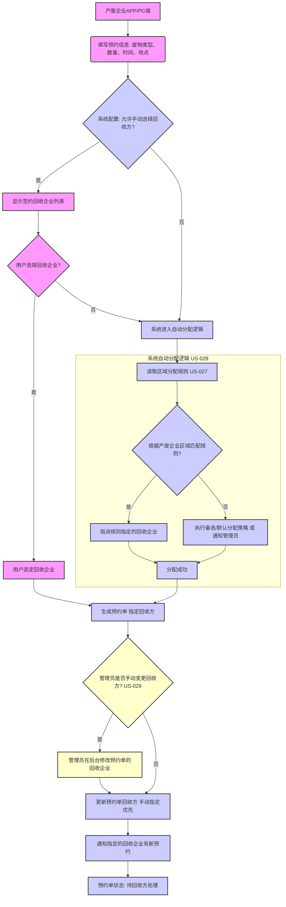
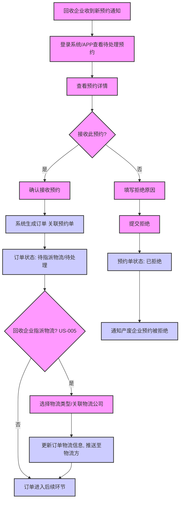
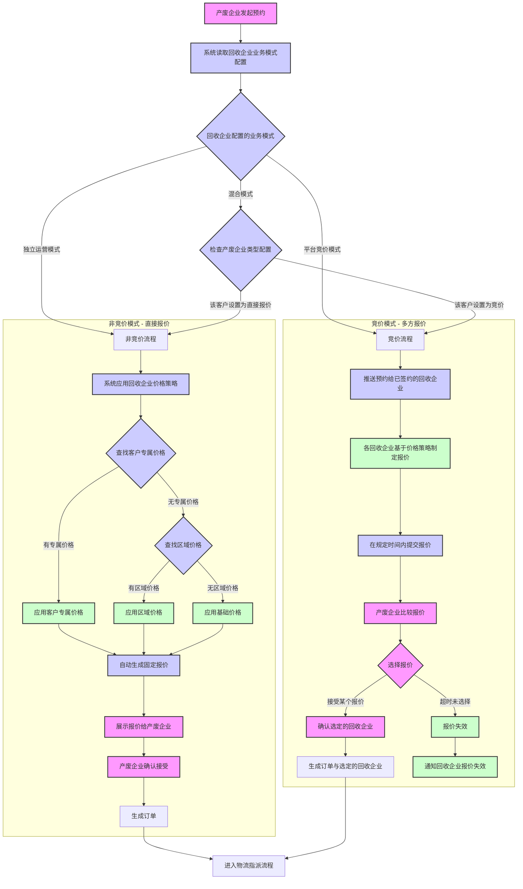
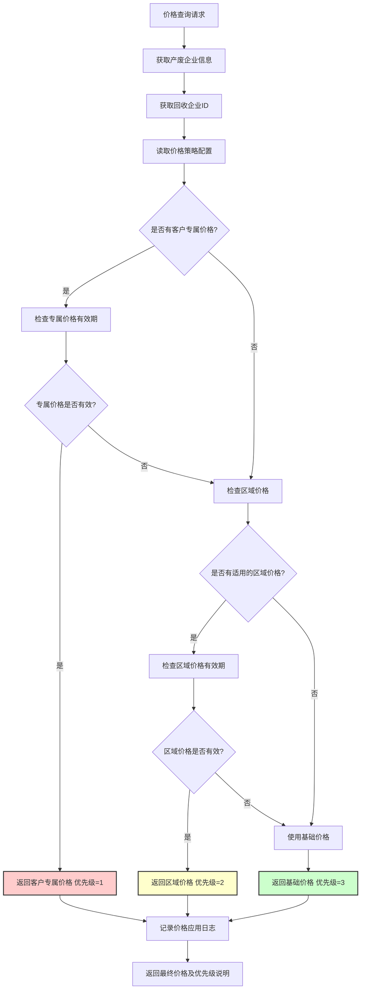
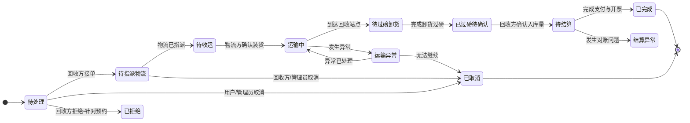

# 危险废物转移模块核心业务流程文档

## 1. 概述

本文档使用Mermaid流程图描述危险废物转移模块中的关键业务流程，包括预约发起、回收方分配、订单生成与处理、临时订单创建等，旨在清晰地展示各角色之间的交互和系统处理逻辑。

## 2. 核心业务流程

### 2.1 产废企业发起预约及回收方分配流程

*关联用户故事：US-003, US-027, US-028, US-029*



### 2.2 回收企业处理预约并生成订单流程

*关联用户故事：US-004, US-005*



### 2.3 临时订单（扫街回收）创建流程

*关联用户故事：US-017*

```mermaid
flowchart TD
    A[司机发现临时回收需求] --> B[打开物流APP]
    B --> C[选择"上报临时需求"功能]
    C --> D[填写基本信息：废物类型、预估数量、产废方信息]
    D --> E[获取当前GPS位置]
    E --> F[拍摄现场照片]
    F --> G[提交临时需求]
    
    G --> H{物流模块处理}
    H --> I[调用危废模块API创建订单]
    I --> J[危废模块生成订单]
    J --> K[返回订单信息给物流模块]
    K --> L[物流模块创建运输任务]
    L --> M[关联订单和任务]
    M --> N[返回成功信息给司机]
    
    N --> O[司机看到新任务]
    O --> P[开始执行运输任务]

    classDef driverAction fill:#f9f,stroke:#333,stroke-width:2px
    classDef logisticsModule fill:#ccf,stroke:#333,stroke-width:2px
    classDef wasteModule fill:#cfc,stroke:#333,stroke-width:2px

    class A,B,C,D,E,F,G,O,P driverAction
    class H,I,K,L,M,N logisticsModule
    class J wasteModule
```

### 2.4 智能报价流程（竞价模式 vs 非竞价模式）

*关联用户故事：US-037, US-038, US-045, US-046*



### 2.5 价格策略应用流程

*关联用户故事：US-046, US-047, US-048*



### 2.6 订单状态流转图



## 3. 关键数据表关联说明

- **`waste_transfer_appointment` (预约单表):** 存储预约的核心信息，包括产废方、意向回收方（或系统分配的回收方）、废物详情、预约时间、状态等。`status` 字段反映预约的生命周期（待处理、已接受、已拒绝、已取消、已转订单）。

- **`waste_transfer_order` (订单主表):** 当预约被接受或临时订单创建时生成。包含预约单ID（若有）、产废方、回收方、物流方（若已分配）、废物详情（可能来自预约或重新确认）、订单金额（预估/实际）、订单状态、来源类型（预约/扫街）等。`status` 字段反映订单的复杂流转过程。

- **`waste_recycler_assignment_rule` (回收企业分配规则表):** 存储系统管理员配置的用于自动分配回收企业的规则，如按区域、废物类型等将产废方匹配到特定的回收企业。与 `waste_transfer_appointment` 在分配时关联。

- **`enterprise_info` (企业信息表):** 为预约单和订单中的产废企业、回收企业、物流企业提供详细的企业背景信息。

- **`system_users` / `member_users` (用户表):** 关联操作的发起人、处理人。

*(其他如物流节点、过磅、支付、发票等表将与订单表通过订单ID进行关联，具体设计见相应模块。)*

## 4. 过磅分摊流程

```