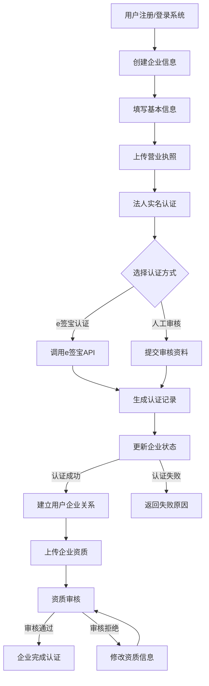
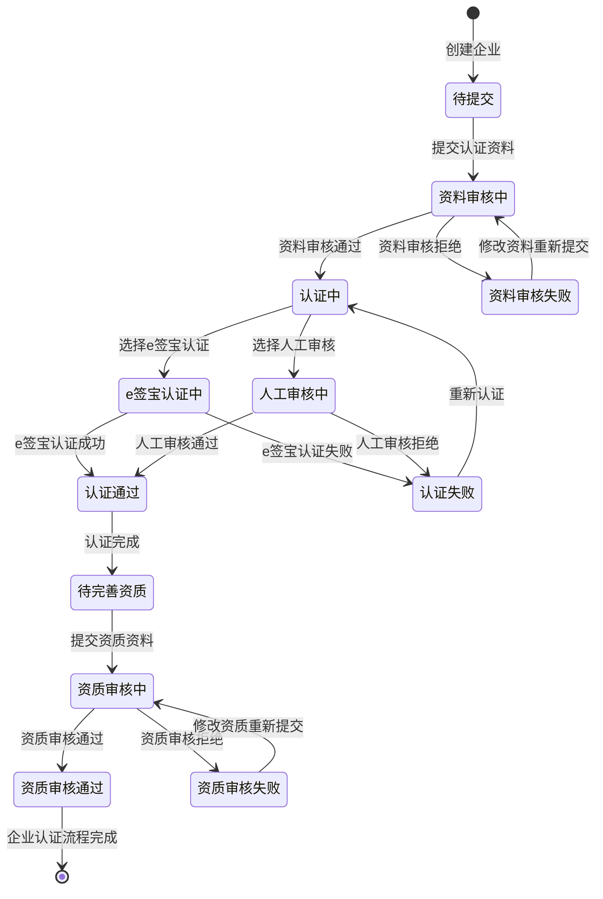
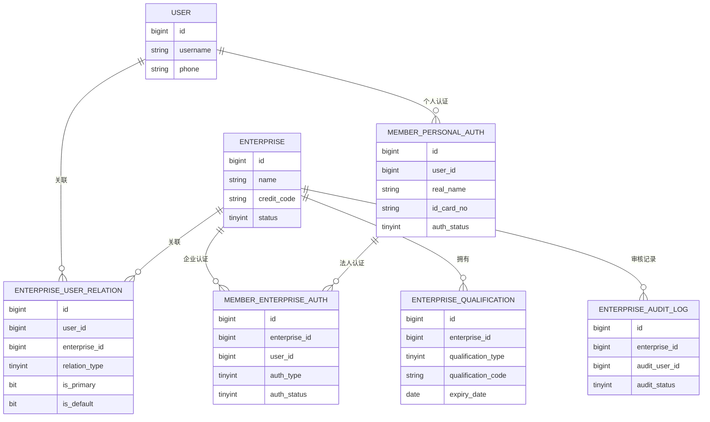

# 企业信息模块设计文档

## 1. 模块概述

### 1.1 模块简介
企业信息模块是危废再生资源全流程追溯SaaS平台的核心基础模块，主要用于管理产废企业、回收企业、处置企业等各类企业的基本信息、资质认证、组织架构等核心数据。该模块通过集成e签宝实现企业实名认证，确保企业资质真实有效，为企业提供完整的信息管理解决方案，支持企业信息的录入、查询、修改和审核等功能，为后续的危废转移、物流管理、支付结算等业务提供基础数据支持。

### 1.2 功能范围

#### 1.2.1 企业认证管理
1. 企业基本信息管理
   - 支持企业基础信息的录入、修改、查询
   - 必填信息：企业名称、统一社会信用代码、法定代表人、注册资本、成立日期、经营范围、注册地址
   - 支持营业执照、经营许可证等资质文件的上传和管理
   - 支持企业信息的批量导入导出
   - 支持企业信息的变更历史记录

2. 企业实名认证
   - 集成e签宝实现企业三要素验证（企业名称、统一社会信用代码、法定代表人）
   - 支持营业执照电子签章验证
   - 支持法人代表身份证OCR识别和人脸比对
   - 认证结果实时返回，失败时提供明确原因
   - 支持认证信息的重新提交和审核

3. 企业资质审核
   - 支持后台管理员对企业资质的人工审核
   - 审核流程：提交申请 -> 初审 -> 复审 -> 终审
   - 支持审核意见的填写和反馈
   - 支持审核状态的实时更新和通知
   - 支持审核历史记录的查询

4. 企业认证区块链存证
   - 认证数据同步至e签宝区块链
   - 提供存证哈希查询功能
   - 支持认证数据的真实性验证
   - 支持存证记录的导出和打印

#### 1.2.2 企业组织管理
1. 多门店企业管理
   - 支持总部-分店的组织架构管理
   - 支持分店信息的独立维护
   - 支持总部对分店的统一管理
   - 支持分店数据的独立统计
   - 支持多门店间的数据隔离

2. 企业人员管理
   - 支持企业人员的基本信息管理
   - 支持收运员、财务等不同角色的管理
   - 支持人员与门店的关联
   - 支持人员状态的管理（在职、离职等）
   - 支持人员操作日志的记录

3. 企业权限管理
   - 支持基于角色的权限控制
   - 支持总部和分店的权限分级
   - 支持自定义权限组
   - 支持权限的批量分配
   - 支持权限变更的审计日志

#### 1.2.3 企业资质管理
1. 企业资质证书管理
   - 支持多种类型资质证书的管理
   - 支持证书信息的录入和更新
   - 支持证书文件的上传和下载
   - 支持证书状态的实时监控
   - 支持证书信息的批量导入

2. 资质到期提醒
   - 支持证书到期时间的设置
   - 支持到期提醒的自动触发
   - 支持多级提醒机制（如：30天、15天、7天、3天）
   - 支持提醒方式的配置（短信、邮件、系统消息）
   - 支持提醒记录的查询

3. 资质变更记录
   - 支持资质信息的变更记录
   - 支持变更原因的记录
   - 支持变更前后的对比
   - 支持变更审批流程
   - 支持变更历史的查询

4. 资质审核流程
   - 支持资质审核的流程配置
   - 支持多级审核机制
   - 支持审核意见的填写
   - 支持审核状态的跟踪
   - 支持审核记录的导出

#### 1.2.4 企业数据管理
1. 企业基础信息维护
   - 支持企业信息的实时更新
   - 支持信息变更的审批流程
   - 支持历史版本的记录和回溯
   - 支持信息完整性的校验
   - 支持批量信息的更新

2. 企业认证状态管理
   - 支持认证状态的实时监控
   - 支持状态变更的自动通知
   - 支持状态变更的审批流程
   - 支持状态历史的查询
   - 支持状态统计报表

3. 企业数据统计分析
   - 支持企业数据的多维度统计
   - 支持统计报表的自动生成
   - 支持数据趋势的分析
   - 支持自定义统计维度
   - 支持报表的导出和打印

4. 企业信息变更历史
   - 支持所有信息变更的记录
   - 支持变更前后的对比
   - 支持变更原因的记录
   - 支持变更人的记录
   - 支持变更历史的查询和导出

#### 1.2.5 企业合规管理
1. 企业资质合规性检查
   - 支持资质有效性的自动检查
   - 支持合规性预警的触发
   - 支持不合规项的整改跟踪
   - 支持合规性报告的生成
   - 支持合规性评分

2. 企业认证数据同步
   - 支持与e签宝的数据实时同步
   - 支持同步状态的监控
   - 支持同步失败的处理
   - 支持同步日志的记录
   - 支持手动触发同步

3. 企业信息区块链存证
   - 支持关键信息的区块链存证
   - 支持存证信息的查询
   - 支持存证证明的生成
   - 支持存证记录的导出
   - 支持存证状态的监控

4. 企业合规报告生成
   - 支持定期合规报告的生成
   - 支持自定义报告模板
   - 支持报告内容的审核
   - 支持报告的导出和打印
   - 支持历史报告的查询

### 1.3 用户故事对应关系

本模块实现了以下用户故事（User Story）的需求：

#### 1.3.1 企业认证相关故事
| 用户故事ID | 用户角色 | 对应功能 | 实现状态 |
|------------|----------|----------|----------|
| US-001 | 所有用户 | 企业认证管理 > 企业基本信息管理 | 已实现 |
| US-002 | 所有企业用户 | 企业认证管理 > 企业资质审核 | 已实现 |
| US-024 | 个人用户 | 企业认证管理 > 企业实名认证 | 已实现 |
| US-025 | 企业用户 | 企业认证管理 > 企业实名认证 | 已实现 |
| US-026 | 系统管理员 | 企业认证管理 > 企业认证区块链存证 | 已实现 |

#### 1.3.2 企业组织相关故事
| 用户故事ID | 用户角色 | 对应功能 | 实现状态 |
|------------|----------|----------|----------|
| US-014 | 回收企业（财务） | 企业组织管理 > 企业人员管理 | 已实现 |
| US-015 | 产废企业（多门店） | 企业组织管理 > 多门店企业管理 | 已实现 |

#### 1.3.3 企业资质相关故事
| 用户故事ID | 用户角色 | 对应功能 | 实现状态 |
|------------|----------|----------|----------|
| US-002 | 所有企业用户 | 企业资质管理 > 企业资质证书管理 | 已实现 |
| US-002 | 所有企业用户 | 企业资质管理 > 资质审核流程 | 已实现 |

#### 1.3.4 企业数据相关故事
| 用户故事ID | 用户角色 | 对应功能 | 实现状态 |
|------------|----------|----------|----------|
| US-013 | 产废企业 | 企业数据管理 > 企业数据统计分析 | 已实现 |
| US-013 | 产废企业 | 企业数据管理 > 企业信息变更历史 | 已实现 |

#### 1.3.5 企业合规相关故事
| 用户故事ID | 用户角色 | 对应功能 | 实现状态 |
|------------|----------|----------|----------|
| US-010 | 系统 | 企业合规管理 > 企业认证数据同步 | 已实现 |
| US-026 | 系统管理员 | 企业合规管理 > 企业信息区块链存证 | 已实现 |

### 1.4 用户故事实现说明

1. 企业认证流程（US-001, US-002, US-024, US-025）
   - 支持用户注册和登录
   - 实现企业认证和资质审核
   - 集成e签宝完成实名认证
   - 支持认证数据的区块链存证

2. 多门店管理（US-015）
   - 支持总部-分店架构
   - 实现分店独立管理
   - 支持资金统一归集
   - 支持分店数据统计

3. 企业人员管理（US-014）
   - 支持收运员账户管理
   - 实现承包制结算
   - 支持绩效报表生成
   - 支持收支流水管理

4. 数据统计分析（US-013）
   - 支持对账单导出
   - 实现数据多维度统计
   - 支持报表自动生成
   - 支持数据趋势分析

5. 合规管理（US-010, US-026）
   - 支持数据同步至国家系统
   - 实现区块链存证
   - 支持合规性检查
   - 支持合规报告生成

## 2. 系统架构

### 2.1 技术架构
- 后端框架：Spring Boot
- 数据库：MySQL
- 缓存：Redis
- 权限认证：Spring Security + JWT

### 2.2 模块结构
```
yudao-module-enterprise
├── yudao-module-enterprise-biz        // 业务模块
│   ├── controller                     // 控制器层
│   ├── service                        // 服务层
│   ├── dal                           // 数据访问层
│   │   ├── dataobject                // 数据库实体
│   │   ├── mysql                     // MySQL 实现
│   │   └── redis                     // Redis 实现
│   └── convert                       // 对象转换层
└── yudao-module-enterprise-api        // API 模块
    └── enums                         // 枚举定义
```

## 3. 数据库设计

### 3.1 核心表结构

#### 企业信息表 (enterprise_info)
| 字段名 | 类型 | 说明 | 备注 |
|--------|------|------|------|
| id | bigint | 主键ID | 自增 |
| tenant_id | bigint | 租户ID | 非空，默认0 |
| name | varchar(100) | 企业名称 | 非空 |
| credit_code | varchar(18) | 统一社会信用代码 | 非空，唯一 |
| enterprise_type | enum | 企业类型 | 非空，producer(产废)/collector(收集)/disposer(处置)/logistics(物流) |
| legal_person | varchar(64) | 法人姓名 | 非空 |
| legal_person_id_card | varchar(18) | 法人身份证号 | 非空 |
| contact_name | varchar(64) | 联系人姓名 | 非空 |
| contact_phone | varchar(11) | 联系人电话 | 非空 |
| province | varchar(20) | 省份 | 非空 |
| city | varchar(20) | 城市 | 非空 |
| district | varchar(20) | 区县 | 非空 |
| address | varchar(255) | 详细地址 | 非空 |
| business_license_id | bigint | 营业执照附件ID | 非空 |
| status | tinyint | 状态 | 非空，默认0，0-待审核 1-审核通过 2-审核拒绝 |
| audit_remark | varchar(255) | 审核备注 | 可选 |
| audit_time | datetime | 审核时间 | 可选 |
| audit_user_id | bigint | 审核人ID | 可选 |
| creator | varchar(64) | 创建者 | 默认空字符串 |
| create_time | datetime | 创建时间 | 非空，默认CURRENT_TIMESTAMP |
| updater | varchar(64) | 更新者 | 默认空字符串 |
| update_time | datetime | 更新时间 | 非空，默认CURRENT_TIMESTAMP，自动更新 |
| deleted | bit(1) | 是否删除 | 非空，默认b'0' |

#### 企业资质表 (enterprise_qualification)
| 字段名 | 类型 | 说明 | 备注 |
|--------|------|------|------|
| id | bigint | 主键ID | 非空 |
| enterprise_id | bigint | 企业ID | 非空，外键 |
| qualification_type | tinyint | 资质类型 | 非空，1-危废经营许可证 2-道路运输许可证 3-回收资质证明 4-其他 |
| qualification_name | varchar(100) | 资质名称 | 非空 |
| qualification_code | varchar(50) | 资质编号 | 非空 |
| issue_date | date | 发证日期 | 非空 |
| expiry_date | date | 到期日期 | 非空 |
| issuing_authority | varchar(100) | 发证机关 | 非空 |
| file_url | varchar(255) | 资质文件URL | 非空 |
| create_time | datetime | 创建时间 | 非空，默认CURRENT_TIMESTAMP |
| update_time | datetime | 更新时间 | 非空，默认CURRENT_TIMESTAMP，自动更新 |
| create_by | varchar(64) | 创建人 | 可选 |
| update_by | varchar(64) | 更新人 | 可选 |
| is_deleted | tinyint(1) | 是否删除 | 非空，默认0，0-未删除 1-已删除 |
| deleted | tinyint(1) | 是否删除 | 非空，默认0 |
| tenant_id | bigint | 租户编号 | 非空，默认1 |

#### 用户企业关系表 (enterprise_user_relation)
| 字段名 | 类型 | 说明 | 备注 |
|--------|------|------|------|
| id | bigint | 主键ID | 非空 |
| tenant_id | bigint | 租户ID | 非空，默认0 |
| enterprise_id | bigint | 企业ID | 非空，外键 |
| user_id | bigint | 用户ID | 非空，外键 |
| relation_type | tinyint | 关系类型 | 非空，1-企业管理员 2-企业员工 3-会员 |
| is_primary | bit(1) | 是否主管理员 | 非空，默认b'0'，仅当relation_type=1时有效 |
| is_default | bit(1) | 是否默认企业 | 非空，默认b'0'，仅当relation_type=3时有效 |
| creator | varchar(64) | 创建者 | 默认空字符串 |
| create_time | datetime | 创建时间 | 非空，默认CURRENT_TIMESTAMP |
| updater | varchar(64) | 更新者 | 默认空字符串 |
| update_time | datetime | 更新时间 | 非空，默认CURRENT_TIMESTAMP，自动更新 |
| deleted | bit(1) | 是否删除 | 非空，默认b'0' |

#### 企业认证表 (enterprise_auth)
| 字段名 | 类型 | 说明 | 备注 |
|--------|------|------|------|
| id | bigint unsigned | 认证ID | 自增 |
| enterprise_id | bigint unsigned | 企业ID | 非空 |
| user_id | bigint unsigned | 提交认证的用户ID | 非空 |
| auth_type | tinyint unsigned | 认证类型 | 非空 |
| legal_rep_auth_id | bigint unsigned | 法人个人实名认证ID | 可选 |
| submitted_business_license_url | varchar(255) | 提交的营业执照URL | 可选 |
| submitted_operating_permit_url | varchar(255) | 提交的经营许可证URL | 可选 |
| auth_status | tinyint unsigned | 认证状态 | 非空，默认0 |
| audit_user_id | bigint unsigned | 审核员ID | 可选 |
| audit_time | datetime | 审核时间 | 可选 |
| audit_remarks | varchar(500) | 审核备注/失败原因 | 可选 |
| esign_auth_channel | varchar(50) | e签宝认证渠道 | 可选 |
| esign_channel_request_id | varchar(100) | e签宝请求ID | 可选 |
| esign_channel_flow_id | varchar(100) | e签宝流程ID | 可选 |
| blockchain_tx_hash | varchar(100) | 区块链存证哈希 | 可选 |
| create_time | datetime | 提交时间 | 非空，默认CURRENT_TIMESTAMP |
| update_time | datetime | 更新时间 | 非空，默认CURRENT_TIMESTAMP，自动更新 |
| creator | varchar(64) | 创建者ID | 可选 |
| updater | varchar(64) | 更新者ID | 可选 |
| deleted | tinyint unsigned | 是否删除 | 非空，默认0 |

#### 企业审核记录表 (enterprise_audit_log)
| 字段名 | 类型 | 说明 | 备注 |
|--------|------|------|------|
| id | bigint | 主键ID | 自增 |
| enterprise_id | bigint | 企业ID | 非空，外键 |
| audit_user_id | bigint | 审核人ID | 非空 |
| audit_status | tinyint | 审核状态 | 0-待审核 1-审核通过 2-审核拒绝 |
| audit_remark | varchar(255) | 审核备注 | |
| audit_time | datetime | 审核时间 | 非空，默认CURRENT_TIMESTAMP |
| create_time | datetime | 创建时间 | 非空，默认CURRENT_TIMESTAMP |
| update_time | datetime | 更新时间 | 非空，默认CURRENT_TIMESTAMP，自动更新 |
| create_by | varchar(64) | 创建者 | |
| update_by | varchar(64) | 更新者 | |
| is_deleted | tinyint(1) | 是否删除 | 0-未删除 1-已删除，默认0 |

#### 个人实名认证表 (member_personal_auth)
| 字段名 | 类型 | 说明 | 备注 |
|--------|------|------|------|
| id | bigint | 认证ID | 自增 |
| user_id | bigint | 用户ID | 非空，外键 |
| real_name | varchar(50) | 真实姓名 | 非空 |
| id_card_no | varchar(18) | 身份证号码 | 非空 |
| id_card_front_url | varchar(255) | 身份证正面照片URL | |
| id_card_back_url | varchar(255) | 身份证反面照片URL | |
| auth_status | tinyint | 认证状态 | 0-待认证 1-认证中 2-认证通过 3-认证失败 |
| auth_channel | varchar(50) | 认证渠道 | |
| channel_request_id | varchar(100) | 渠道方请求ID | |
| channel_flow_id | varchar(100) | 渠道方流程ID | |
| failure_reason | varchar(255) | 认证失败原因 | |
| auth_time | datetime | 认证通过/失败时间 | |
| create_time | datetime | 创建时间 | 非空，默认CURRENT_TIMESTAMP |
| update_time | datetime | 更新时间 | 非空，默认CURRENT_TIMESTAMP，自动更新 |
| create_by | varchar(64) | 创建者 | |
| update_by | varchar(64) | 更新者 | |
| is_deleted | tinyint(1) | 是否删除 | 0-未删除 1-已删除，默认0 |

#### 企业门店表 (enterprise_store)
| 字段名 | 类型 | 说明 | 备注 |
|--------|------|------|------|
| id | bigint(20) | 门店ID | 主键 |
| enterprise_id | bigint(20) | 所属企业ID | 外键，关联enterprise_info.id |
| parent_id | bigint(20) | 上级门店ID | 用于分层结构，总店/区域中心等 |
| name | varchar(100) | 门店名称 | 非空 |
| address | varchar(255) | 门店地址 | |
| contact_name | varchar(64) | 门店联系人 | |
| contact_phone | varchar(20) | 门店联系电话 | |
| status | tinyint(4) | 门店状态 | 非空，默认0，0-正常 1-停用 |
| tenant_id | bigint(20) | 租户ID | 非空，默认0 |
| creator | varchar(64) | 创建者 | 默认空字符串 |
| create_time | datetime | 创建时间 | 非空，默认CURRENT_TIMESTAMP |
| updater | varchar(64) | 更新者 | 默认空字符串 |
| update_time | datetime | 更新时间 | 非空，默认CURRENT_TIMESTAMP，自动更新 |
| deleted | bit(1) | 是否删除 | 非空，默认b'0' |

### 3.2 表关系说明
1. 企业信息表 (enterprise_info)
   - 主键：id
   - 唯一索引：credit_code
   - 普通索引：tenant_id

2. 企业资质表 (enterprise_qualification)
   - 主键：id
   - 外键：enterprise_id 关联 enterprise_info.id
   - 普通索引：enterprise_id

3. 用户企业关系表 (enterprise_user_relation)
   - 主键：id
   - 唯一索引：enterprise_id, user_id, relation_type
   - 外键：enterprise_id 关联 enterprise_info.id
   - 外键：user_id 关联 system_users.id
   - 普通索引：user_id, tenant_id, relation_type

4. 企业审核记录表 (enterprise_audit_log)
   - 主键：id
   - 外键：enterprise_id 关联 enterprise_info.id
   - 普通索引：enterprise_id

5. 企业认证表 (member_enterprise_auth)
   - 主键：id
   - 外键：enterprise_id 关联 enterprise_info.id
   - 外键：user_id 关联 member_user.id
   - 普通索引：auth_status

6. 个人实名认证表 (member_personal_auth)
   - 主键：id
   - 外键：user_id 关联 system_users.id
   - 普通索引：auth_status, auth_channel

7. 企业门店表 (enterprise_store)
   - 主键：id
   - 外键：enterprise_id 关联 enterprise_info.id
   - 外键：parent_id 关联 enterprise_store.id
   - 普通索引：enterprise_id, tenant_id

## 4. 接口设计

### 4.1 企业信息管理接口
#### 4.1.1 创建企业信息
- 请求路径：`POST /admin-api/enterprise/info/create`
- 请求方式：POST
- 请求参数：
```json
{
    "name": "企业名称",
    "creditCode": "统一社会信用代码",
    "legalPerson": "法定代表人",
    "registerCapital": "注册资本",
    "establishDate": "成立日期",
    "businessScope": "经营范围",
    "address": "注册地址"
}
```
- 响应结果：
```json
{
    "code": 0,
    "data": "企业ID",
    "msg": "success"
}
```

#### 4.1.2 更新企业信息
- 请求路径：`PUT /admin-api/enterprise/info/update`
- 请求方式：PUT
- 请求参数：同创建接口
- 响应结果：同创建接口

#### 4.1.3 获取企业信息
- 请求路径：`GET /admin-api/enterprise/info/get`
- 请求方式：GET
- 请求参数：`id` - 企业ID
- 响应结果：
```json
{
    "code": 0,
    "data": {
        "id": "企业ID",
        "name": "企业名称",
        "creditCode": "统一社会信用代码",
        "legalPerson": "法定代表人",
        "registerCapital": "注册资本",
        "establishDate": "成立日期",
        "businessScope": "经营范围",
        "address": "注册地址",
        "status": "状态",
        "createTime": "创建时间"
    },
    "msg": "success"
}
```

### 4.2 企业资质认证接口
（接口设计类似，可根据实际需求补充）

## 5. 权限设计

### 5.1 权限标识
- `enterprise:info:query` - 企业信息查询
- `enterprise:info:create` - 企业信息创建
- `enterprise:info:update` - 企业信息更新
- `enterprise:info:delete` - 企业信息删除
- `enterprise:cert:query` - 企业资质查询
- `enterprise:cert:create` - 企业资质创建
- `enterprise:cert:update` - 企业资质更新
- `enterprise:cert:delete` - 企业资质删除

## 6. 缓存设计

### 6.1 缓存策略
- 企业基本信息缓存
  - 缓存键：`enterprise:info:{id}`
  - 缓存类型：Hash
  - 过期时间：24小时
  - 更新策略：更新时删除缓存

- 企业资质信息缓存
  - 缓存键：`enterprise:cert:{enterpriseId}`
  - 缓存类型：Hash
  - 过期时间：24小时
  - 更新策略：更新时删除缓存

## 7. 扩展性设计

### 7.1 可扩展点
1. 企业信息字段扩展
   - 通过配置化方式支持自定义字段
   - 预留扩展字段

2. 资质认证类型扩展
   - 支持动态配置认证类型
   - 支持自定义认证流程

3. 数据导入导出
   - 支持多种格式的数据导入导出
   - 支持自定义导入导出模板

## 8. 注意事项

### 8.1 开发规范
1. 代码规范
   - 遵循阿里巴巴Java开发手册
   - 使用统一的代码格式化工具
   - 编写完整的单元测试

2. 接口规范
   - 统一使用RESTful风格
   - 请求参数必须进行校验
   - 返回结果统一封装

3. 数据库规范
   - 表名、字段名使用下划线命名
   - 必须包含基础字段（id、create_time等）
   - 合理使用索引

### 8.2 安全考虑
1. 数据安全
   - 敏感信息加密存储
   - 操作日志完整记录
   - 数据访问权限控制

2. 接口安全
   - 接口访问权限控制
   - 参数合法性校验
   - 防SQL注入、XSS攻击

## 9. 后续规划

### 9.1 功能规划
1. 企业信息管理
   - [ ] 企业信息批量导入导出
   - [ ] 企业信息变更历史记录
   - [ ] 企业信息审核流程

2. 资质认证管理
   - [ ] 资质到期提醒
   - [ ] 资质自动审核
   - [ ] 资质变更记录

3. 统计分析
   - [ ] 企业数据统计报表
   - [ ] 资质认证分析
   - [ ] 数据可视化展示

### 9.2 性能优化
1. 缓存优化
   - [ ] 多级缓存策略
   - [ ] 缓存预热机制
   - [ ] 缓存更新策略优化

2. 查询优化
   - [ ] 索引优化
   - [ ] 分页查询优化
   - [ ] 大数据量处理优化

## 10. 业务流程分析

### 10.1 表结构分析

根据数据库表结构分析，企业信息模块的核心业务流程涉及以下关键表：

1. **企业信息表(enterprise_info)**
   - 存储企业基本信息，包括企业名称、统一社会信用代码、法人信息等
   - 通过status字段(0-待审核，1-审核通过，2-审核拒绝)标记企业认证状态
   - 包含audit_xxx相关字段记录审核信息

2. **企业认证表(member_enterprise_auth)**
   - 存储企业认证的详细信息，包括认证类型、认证状态、认证材料等
   - 通过e签宝认证相关字段与第三方认证服务集成
   - 支持区块链存证，保证认证信息不可篡改

3. **企业资质表(enterprise_qualification)**
   - 存储企业各类资质证书信息，包括资质类型、证书编号、有效期等
   - 一个企业可以有多种资质类型(危废经营许可证、道路运输许可证等)

4. **企业审核记录表(enterprise_audit_log)**
   - 记录每次审核操作的详细信息，包括审核人、审核状态、审核备注等
   - 提供完整的审计跟踪，便于追溯审核历史

5. **用户企业关系表(enterprise_user_relation)**
   - 定义用户与企业的关系，包括企业管理员、企业员工、企业会员等
   - 支持多用户管理同一企业，以及一个用户管理多个企业

6. **个人实名认证表(member_personal_auth)**
   - 记录个人实名认证信息，为企业法人认证提供支持
   - 与企业认证相互关联，确保企业认证的真实性

### 10.2 企业创建与认证流程

根据表结构分析，我们可以梳理出完整的企业创建与认证流程：



### 10.3 企业认证状态流转图



### 10.4 用户与企业关系图



### 10.5 业务流程说明

#### 企业创建与认证流程
1. **企业信息创建**
   - 用户注册并登录系统后，创建企业基本信息
   - 系统生成企业记录，状态设为"待审核"
   - 创建用户与企业的关联关系，设置为企业管理员

2. **企业认证准备**
   - 企业管理员完善企业信息，上传营业执照
   - 企业法人进行个人实名认证(通过member_personal_auth表)
   - 创建企业认证记录(member_enterprise_auth)，关联法人认证ID

3. **企业认证**
   - 支持e签宝三要素验证(企业名称、统一社会信用代码、法人)
   - 通过e签宝API进行认证，生成认证记录
   - 认证数据存入区块链，生成存证哈希

4. **审核流程**
   - 根据认证结果或人工审核，更新企业状态
   - 记录审核操作到企业审核记录表(enterprise_audit_log)
   - 审核通过后，企业状态变更为"有效"

5. **资质管理**
   - 企业认证通过后，可以上传各类资质证书信息
   - 系统记录资质到期时间，支持到期提醒
   - 资质状态变更同步更新到企业资质表

#### 多角色协作模式
1. **企业管理员**
   - 可以管理企业基本信息和资质信息
   - 可以添加和管理企业员工
   - 查看企业审核状态和历史记录

2. **企业员工**
   - 根据分配的权限使用系统功能
   - 不可修改企业核心信息和认证信息

3. **系统管理员**
   - 负责企业认证的审核
   - 查看认证过程中的区块链存证
   - 处理认证过程中的异常情况

## 11. 注意事项

### 11.1 开发规范
1. 代码规范
   - 遵循阿里巴巴Java开发手册
   - 使用统一的代码格式化工具
   - 编写完整的单元测试

2. 接口规范
   - 统一使用RESTful风格
   - 请求参数必须进行校验
   - 返回结果统一封装

3. 数据库规范
   - 表名、字段名使用下划线命名
   - 必须包含基础字段（id、create_time等）
   - 合理使用索引

### 11.2 安全考虑
1. 数据安全
   - 敏感信息加密存储
   - 操作日志完整记录
   - 数据访问权限控制

2. 接口安全
   - 接口访问权限控制
   - 参数合法性校验
   - 防SQL注入、XSS攻击

## 12. 后续规划

### 12.1 功能规划
1. 企业信息管理
   - [ ] 企业信息批量导入导出
   - [ ] 企业信息变更历史记录
   - [ ] 企业信息审核流程

2. 资质认证管理
   - [ ] 资质到期提醒
   - [ ] 资质自动审核
   - [ ] 资质变更记录

3. 统计分析
   - [ ] 企业数据统计报表
   - [ ] 资质认证分析
   - [ ] 数据可视化展示

### 12.2 性能优化
1. 缓存优化
   - [ ] 多级缓存策略
   - [ ] 缓存预热机制
   - [ ] 缓存更新策略优化

2. 查询优化
   - [ ] 索引优化
   - [ ] 分页查询优化
   - [ ] 大数据量处理优化 


   